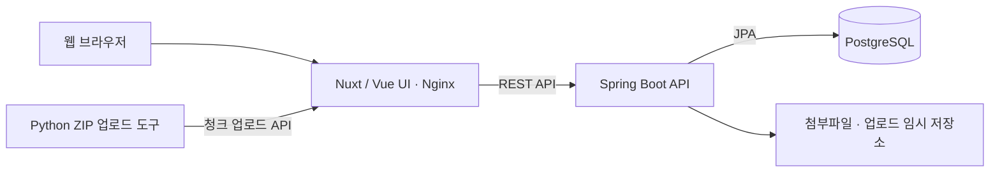

# llm monorepo

게시글, 답변, 첨부파일을 제공하는 게시판 프로젝트입니다. 단일 ZIP 청크 업로드 도구와 결과 게시글 다운로드 기능을 함께 제공합니다.

## 기술 스택

| 영역 | 기술 |
| --- | --- |
| 프론트엔드 | Nuxt 3, Vue 3, TypeScript, Pinia |
| 백엔드 | Java 25, Spring Boot 3.5.11, Spring Data JPA |
| 데이터베이스 | PostgreSQL, Flyway 스키마 마이그레이션 |
| 인증 | JWT 기반 인증, ADMIN/USER 권한 관리 |
| 빌드·실행 | npm, Gradle Wrapper, Docker Compose, Nginx |
| 검증 | JUnit·MockMvc, H2 테스트 DB, TypeScript 타입 검사 |
| 업로드 도구 | Python ZIP 청크 업로드 스크립트 |

## 아키텍처



프론트엔드는 Nuxt로 정적 생성한 화면을 제공하고, Nginx를 통해 백엔드 API를 호출합니다. 백엔드는 인증과 게시글·답변·첨부파일 처리를 담당하며, 데이터는 JPA로 관리하고 스키마 변경은 Flyway로 적용합니다.

ZIP 업로드 도구는 파일을 청크로 나누어 전송합니다. 백엔드는 업로드가 완료되면 원본 ZIP을 복원하고 게시글을 생성하며, 사용자는 웹에서 결과를 조회하고 다운로드합니다.

## 저장소 구성

- `front/`: 화면, 상태 관리, API 클라이언트
- `back/`: API, 도메인, DB 마이그레이션과 테스트
- `upload_zip_post.py`: ZIP 청크 업로드 도구
- `docs/`: 상세 문서 — [문서 목차](docs/index.md)

## 주요 기능

- 로그인 및 관리자 전용 사용자 관리(사용자 추가·수정·삭제, ADMIN/USER 권한)
- 게시글 목록, 상세 조회, 작성, 수정, 삭제와 검색
- 답변 작성, 수정, 삭제
- 게시글 첨부파일 다중 업로드, 개별 삭제와 다운로드
- 단일 ZIP 청크 업로드 후 자동 게시글 생성 및 ZIP 다운로드
- 권한이 있는 게시글 일괄 삭제

AI 답변 생성 기능은 종료되었습니다.

## ZIP 청크 업로드

업로드 도구가 설정된 환경에서 다음 명령을 실행합니다.

```bash
python3 upload_zip_post.py
```

현재 디렉터리에서 ZIP 파일 하나를 선택하면 청크 단위로 업로드합니다. 중단된 업로드는 이어올릴 수 있으며, 완료하면 게시글이 자동 생성됩니다. 웹에서 결과 게시글을 조회하고 ZIP 파일을 다운로드할 수 있습니다.

## 이용 안내

- 게시글 목록, 상세와 첨부파일 다운로드는 로그인 없이 이용할 수 있습니다.
- 게시글과 댓글은 작성자 본인 또는 ADMIN만 수정·삭제할 수 있습니다. 작성자가 없는 기존 글과 댓글은 ADMIN만 관리할 수 있으며, 일괄 삭제에도 같은 권한 규칙이 적용됩니다.
- 관리자 로그인 ID는 영문과 숫자만 허용합니다.
- 일반 게시글 본문은 비워둘 수 있습니다.
- 일반 게시글에는 첨부파일을 최대 5개까지 추가할 수 있습니다. ZIP 업로드로 생성된 게시글에는 원본 ZIP 한 개가 첨부됩니다.
- 기본 최대 업로드 크기는 100MB입니다.
