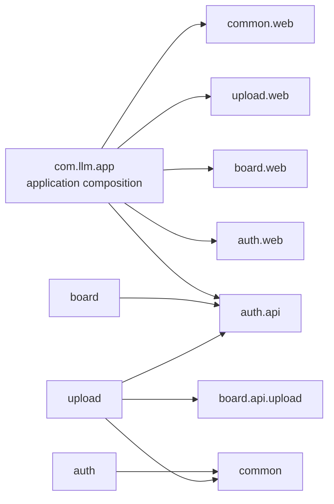

# 아키텍처

## 논리 구성

```text
Browser
  -> Frontend: Nuxt/Vue static SPA served by Nginx
      -> /api/* proxy
          -> Backend: Spring Boot API
              -> PostgreSQL
              -> Attachment volume
              -> Upload-session volume
```

백엔드는 Spring Modulith 기반 모듈형 모놀리스다. 런타임 프로세스는 하나지만 `auth`, `board`, `upload`, `common`의 패키지 경계를 구조 검증으로 강제한다.

## 런타임 구성

| 컴포넌트 | 컨테이너/프로세스 | 역할 |
| --- | --- | --- |
| Frontend | `llm-front` | Nuxt 정적 산출물 제공, `/api/` 요청을 백엔드로 proxy |
| Backend | `llm-back` | REST API, 인증, 게시판, 업로드 세션, 공통 HTTP 오류 조립 |
| Database | `yangyag-postgres` 운영 기준 | PostgreSQL. 전용 database `llm`(schema `llm`) |
| Volumes | `*-llm-back-attachments`, `*-llm-back-upload-sessions` | board가 소유하는 영구 첨부파일과 upload가 소유하는 임시 청크 저장 |

운영 Postgres 관련 이름은 서로 다릅니다.

| 이름 | 정체 |
| --- | --- |
| `yangyag-postgres` | Postgres **컨테이너** 이름이자 Docker DNS 호스트명. 예전 이름 `auto-postgres`. compose 프로젝트 `auto`의 `postgres` 서비스 |
| `auto_default` | Docker **네트워크**. compose 프로젝트 `auto`의 default 네트워크 |
| compose 프로젝트 `auto` | `/home/ubuntu/auto` 스택. LLM compose가 만든 것이 아님 |
| database `llm` | 그 컨테이너 안의 LLM 전용 DB. 스키마 이름도 `llm` |
| `APP_DB_HOST=yangyag-postgres` | `llm-back`이 `auto_default`에서 컨테이너를 찾는 이름 |

`docker-compose.yml`의 `back` 서비스는 `default` 네트워크와 외부 `auto_default` 네트워크에 동시에 연결됩니다. 운영 DB는 `auto_default`를 통해 `yangyag-postgres:5432`로 접근합니다.

Postgres는 호스트에 `127.0.0.1:5432`로만 publish되어 있습니다. `127.0.0.1`의 기준은 **그 프로세스가 도는 곳**입니다.

- EC2 **호스트**에서 도는 프로그램(같은 머신의 Python 백엔드 등)의 `127.0.0.1:5432`는 EC2 자신이라 붙습니다.
- `llm-back` **컨테이너 안**의 `127.0.0.1`은 백엔드 자신이라 Postgres가 없습니다. LLM은 `APP_DB_HOST=yangyag-postgres`로만 붙습니다.

`llm-front`를 호스트 네트워크로 바꿔 `127.0.0.1` DB 접속을 맞추는 방식은 쓰지 않습니다. front Nginx가 `llm-back:8080`으로 proxy하는 구조가 깨집니다.

### 구현된 백엔드 모듈

```text
com.llm.app
├─ auth
│  ├─ api       인증·계정 공개 계약
│  ├─ internal  계정 엔티티·Repository·JWT·컨트롤러·관리 서비스
│  └─ exception 계정 웹 오류
├─ board
│  ├─ api.upload 업로드 결과 게시글 생성·생성 첨부 크기 정책 공개 계약
│  ├─ controller/dto/model/repository/service  게시판 내부 구현
│  └─ exception 게시판 웹 오류
├─ upload
│  ├─ controller/dto  업로드 HTTP API·wire 모델
│  ├─ model/repository 세션·청크 상태
│  ├─ service          청크·복원·wire codec·실패 기록·만료 정리
│  └─ exception        업로드 웹 오류
└─ common              업무 모듈을 참조하지 않는 공통 기술 코드
```

계정 모듈의 이름은 `identity`로 바꾸지 않았다. 실제 패키지는 `auth.api`와 `auth.internal`이며, 다른 모듈은 `auth.api` 공개 계약만 참조한다. `board.api.upload`는 `upload`에 `UploadedPostCreator`와 `GeneratedAttachmentPolicy`를 공개하는 named interface다. `board`가 게시글·첨부 metadata·영구 파일 생명주기를 소유하고 `upload`가 임시 청크·복원 파일·세션 상태를 소유한다.

루트 `com.llm.app.GlobalExceptionHandler`는 애플리케이션 전체에 적용되는 `@RestControllerAdvice`다. auth·board·upload의 공개 업무 예외와 Spring/Jakarta 공통 HTTP 예외를 한 곳에서 기존 오류 응답 형식으로 조립한다. `HealthController`·CORS 설정 같은 전역 기술 조립도 `common.web`에 둔다.

### 모듈 의존 방향



`auth`는 `board`·`upload`를 참조하지 않고, `board`는 `upload`나 `common`을 참조하지 않는다. `upload`만 `board.api.upload`를 통해 게시판 생성 계약을 호출한다. `common`은 업무 모듈을 참조하지 않는다. 루트 조립 영역은 각 모듈의 `api`/`web` named interface만 참조한다. 이 방향은 `ApplicationModules.of(LlmApplication.class).verify()`를 호출하는 `ApplicationModulesDiagnosticTest`로 엄격하게 검증한다.

### 일반 게시글 조회

1. 브라우저가 `GET /api/v1/posts` 또는 `GET /api/v1/posts/{id}`를 호출합니다.
2. Nginx가 `/api/` 요청을 `http://llm-back:8080`으로 proxy합니다.
3. 목록 API는 게시글 요약, 댓글 수, 첨부파일 존재 여부, 변환 준비 여부를 조회합니다.
4. 상세 API는 게시글 본문, 댓글, 첨부파일 메타데이터를 조회합니다.
5. 상세 응답의 `attachments` 배열 각 항목은 `downloadUrl`(`/api/v1/posts/{id}/attachments/{attachmentId}` 형식)을 포함합니다.

### 인증 쓰기 작업

1. 사용자가 `POST /api/v1/auth/login`으로 JWT를 받습니다.
2. 프론트는 쓰기 API에 `Authorization: Bearer <token>`을 보냅니다.
3. 각 보호 컨트롤러가 공통 `JwtProvider.authenticate`로 토큰과 현재 계정 존재 여부를 검증하고 고유 계정 ID를 서비스에 전달합니다. JWT subject는 계정 ID이며 `tokenVersion=2`가 필요합니다.
4. 서비스 계층이 게시글 생성 시 `author_username`을 기록하고, 수정/삭제 시 **작성자 본인 또는 ADMIN 여부**(`admins.role`)를 검증한 뒤 게시글, 댓글, 첨부파일을 처리합니다.

### ZIP 청크 업로드

1. 배포된 `upload_zip_post.py`가 ZIP 바이트를 읽고 SHA-256을 계산합니다.
2. 백엔드는 `APP_UPLOAD_SESSIONS_SECRET`으로 alias 필드별 AES-GCM 암호문 JSON을 복호화합니다. 스크립트는 `LLM_UPLOAD_SESSIONS_SECRET`이 있으면 그 값을 쓰고, 없으면 `APP_UPLOAD_SESSIONS_SECRET`을 사용하므로 최종 secret 값이 백엔드와 같아야 합니다.
3. `POST /api/v1/upload-sessions`가 세션을 만듭니다.
4. `POST /api/v1/upload-sessions/{sessionId}/chunks`가 각 청크를 저장합니다.
5. `POST /api/v1/upload-sessions/{sessionId}/finalize`가 청크를 합치고 SHA-256을 검증한 뒤 게시글과 ZIP 첨부파일을 생성합니다.
6. 세션 row와 임시 디렉터리는 성공 후 정리됩니다.

### AI 답변 기능

`POST /api/v1/posts/{id}/ai-replies` 매핑은 호환성과 원인 파악을 위해 유지되지만, 현재 endpoint는 인증 후 `410 Gone`과 `AI_REPLY_DISABLED`를 반환한다. provider 변환이나 외부 AI API 호출, 새 AI 답변 저장은 수행하지 않는다. `post_replies`의 기존 AI 행과 관련 legacy 코드·오류 매핑은 조회 및 수정/삭제 보호를 위해 남아 있으며, AI 답변 생성 기능을 다시 활성화한 것은 아니다.

### 프론트 자동 로그아웃

1. 로그인 상태에서만 프론트가 유휴 타이머를 동작시킵니다. 마지막 사용자 활동(`mousedown`/`keydown`/`scroll`/`touchstart`) 후 1시간(`IDLE_TIMEOUT_MS`, 프론트 하드코딩 상수) 무동작이면 자동 로그아웃합니다.
2. 활동 시각은 `localStorage`의 `auth_last_activity`에 5초 throttle로 기록되며, 리로드/탭 복원이 유휴 데드라인을 리셋하지 않습니다(로그인 시점에 시드). `visibilitychange`/`focus`로 탭 복귀 시 유휴 시간을 재평가합니다.
3. `front/services/api.ts`의 인증 요청(`Authorization` 헤더 포함)이 `401`을 받으면 `window`에 `auth:unauthorized` 이벤트를 보내고, 인증 플러그인이 이를 수신해 강제 로그아웃한 뒤 `/login`으로 이동합니다. 로그인 요청은 `Authorization` 헤더가 없어 제외됩니다.
4. 자동 로그아웃은 `auth_token`/`auth_username`/`auth_last_activity`를 제거합니다. 이는 프론트 전용 동작이며, 백엔드 JWT는 기존대로 `APP_JWT_EXPIRATION_MS`(기본 1시간) 후 고정 만료하고 토큰 갱신/슬라이딩 세션은 없습니다.

## 계층·패키지 구조

| 계층 | 주요 패키지 |
| --- | --- |
| Application composition | `com.llm.app`, `GlobalExceptionHandler` |
| Auth API | `com.llm.app.auth.api` |
| Auth internal | `com.llm.app.auth.internal`, `com.llm.app.auth.exception` |
| Board | `com.llm.app.board.controller`, `dto`, `model`, `repository`, `service`, `exception` |
| Board public upload API | `com.llm.app.board.api.upload` |
| Upload | `com.llm.app.upload.controller`, `dto`, `model`, `repository`, `service`, `exception` |
| Common | `com.llm.app.common`, `com.llm.app.common.web` |


## 배포 경계

- 프론트 이미지는 빌드 시점 `NUXT_PUBLIC_API_BASE` 값을 정적 번들에 포함할 수 있습니다.
- 운영에서는 Nginx proxy가 같은 origin의 `/api/`를 백엔드로 전달하므로 `NUXT_PUBLIC_API_BASE`를 비워 둡니다.
- 백엔드는 DB와 파일 volume을 상태 저장소로 사용합니다.
- AI provider API key 설정은 새 답변 생성에 사용되지 않습니다. AI endpoint는 `410 Gone` / `AI_REPLY_DISABLED`를 반환하고 legacy AI 행 보호 코드만 유지합니다.
