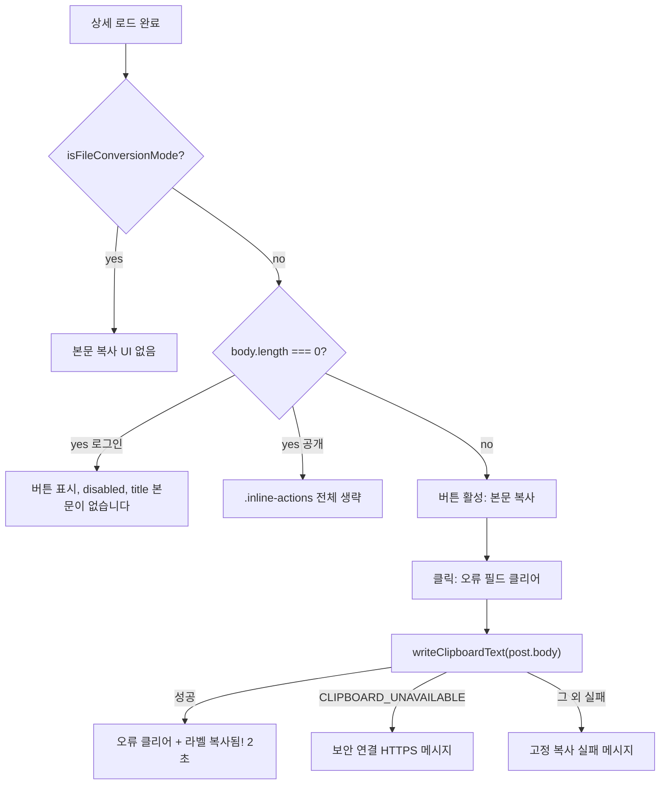
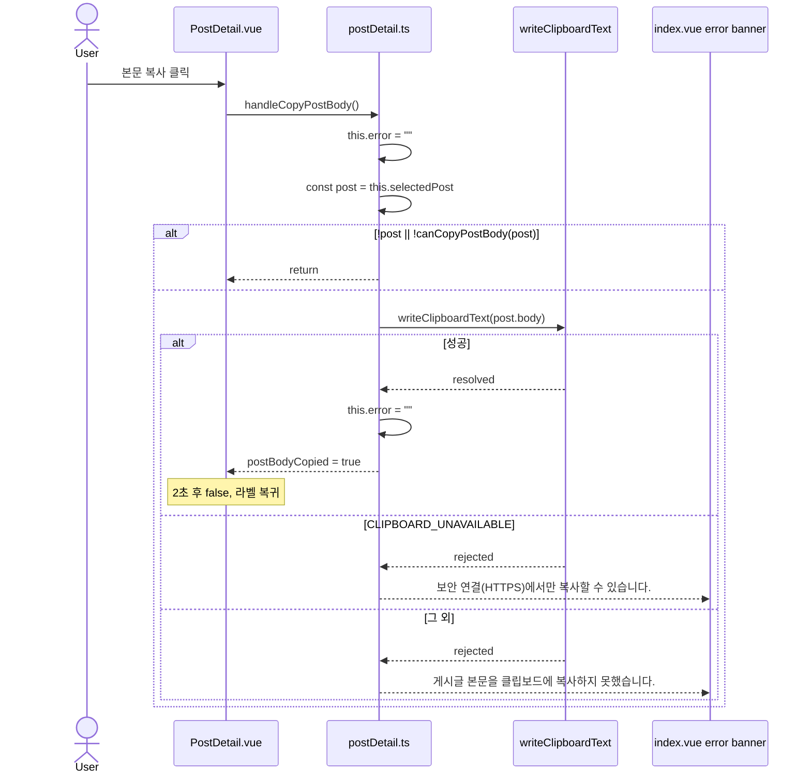
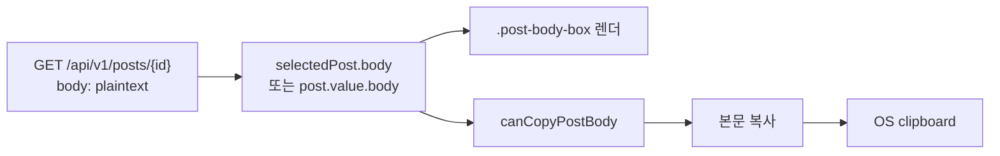

# 게시글 본문 복사 버튼

| 항목 | 값 |
| --- | --- |
| 문서 | 게시글 본문 복사 (clipboard) 설계 |
| 작성 | TBD |
| 날짜 | 2026-08-27 |
| 상태 | Draft |
| 범위 | 프론트엔드 UI만. 백엔드/DB/env 변경 없음 |

## Overview

로그인 게시판 상세(`front/components/post/PostDetail.vue`)와 비로그인 공개 상세(`front/pages/posts/[id].vue`)에 **본문 복사** ghost-button을 추가한다. 클릭 시 화면에 보이는 게시글 본문 — 즉 `GET /api/v1/posts/{id}` 응답의 디코딩된 `body` 문자열 — 을 `navigator.clipboard.writeText`로 시스템 클립보드에 넣는다.

제목, 댓글, URL은 복사하지 않는다. URL 복사는 이미 `handleCopyPostLink()`가 담당한다. 백엔드는 상세 응답에 plaintext `body`를 이미 주므로 신규 API·마이그레이션·환경 변수는 두지 않는다. 구현은 **단일 PR**로 두 표면과 공유 헬퍼를 함께 넣는다.

## Background & Motivation

현재 로그인 상세 우측 액션은 링크 복사 / (권한 시) 수정 / 삭제뿐이다.

```49:52:front/components/post/PostDetail.vue
      <div class="inline-actions">
        <button type="button" class="ghost-button" @click="detail.handleCopyPostLink()">
          {{ detail.postLinkCopied ? "복사됨!" : "링크 복사" }}
        </button>
```

본문은 `.post-body-box`에 plaintext로만 렌더된다.

```72:76:front/components/post/PostDetail.vue
    <ConversionSummary
      v-if="detail.selectedPost && isFileConversionMode(detail.selectedPost.mode)"
      :post="detail.selectedPost"
    />
    <p v-else class="post-body-box">{{ detail.selectedPost?.body }}</p>
```

사용자는 긴 본문을 직접 드래그해야 하고, 공개 상세(`/posts/:id`)에는 복사 컨트롤 자체가 없다. 링크 복사는 origin+id URL만 넣으며(`front/stores/postDetail.ts` `handleCopyPostLink`), 본문과는 무관하다.

클립보드 쓰기는 이미 검증된 패턴이 있다. 동일 스토어가 `window.navigator.clipboard.writeText` 성공 시 2초간 버튼 라벨을 `복사됨!`으로 바꾸고, 실패 시 `this.error`에 한국어 메시지를 넣는다. 본문 복사는 이 UX를 그대로 따른다.

## Goals & Non-Goals

### Goals

- `FILE_CONVERSION_REQUEST`가 아닌 게시글(오늘 `PostMode` 기준으로는 `NORMAL`) 상세에서, 화면에 보이는 `body`를 클립보드에 복사한다. 분기는 기존과 같이 `isFileConversionMode` / `canCopyPostBody`로 한다.
- 로그인 상세와 공개 상세 모두에 같은 라벨(`본문 복사` / `복사됨!`)과 2초 피드백을 제공한다.
- 기존 ghost-button 패턴을 재사용한다.
- `FILE_CONVERSION_REQUEST`에서는 버튼을 숨긴다. 숨긴 raw Base64 본문도, 공개 화면 placeholder 문구도 복사하지 않는다.
- 품질 게이트: `cd front && npm run typecheck && npm run build`. 신규 env 없음.

### Non-Goals

- 제목, 댓글(`ReplyItem.vue`의 `reply.body`), 첨부 메타, 공개 URL 복사.
- 공개 페이지에 **링크 복사**를 새로 다는 것(이미 로그인 상세에 있고, 이번 요청 범위 밖).
- 백엔드 엔드포인트, DTO, Flyway, `application.properties` / `.env` 변경.
- 리치 텍스트/HTML 복사. 본문은 항상 plaintext (`white-space: pre-wrap`).
- 댓글·AI 답변 복사 버튼.
- Vitest 등 프론트 단위 테스트 프레임워크 도입(`front/package.json`에 테스트 스크립트 없음).
- HTTP 비보안 origin을 위한 `document.execCommand("copy")` fallback (링크 복사와 동일하게 이번 변경에서 제외).
- 클립보드 권한 프롬프트 UI, 네이티브 공유 시트(`navigator.share`).
- 성공 라벨을 `링크 복사됨!` / `본문 복사됨!`으로 분화하거나, 수정 모드에서 본문 복사 버튼을 숨기는 것.

## Key Decisions

1. **프론트만 변경한다.** `GET /api/v1/posts/{id}`는 인증 없이 plaintext `body`를 반환한다(`docs/07-api-reference.md`, `BoardMapper.toDetailResponse` → `BoardPostDetailResponse.body`). 클라이언트가 이미 디코딩된 문자열을 들고 있으므로 재요청·`bodyBase64` 재디코딩은 하지 않는다.

2. **복사 대상은 “화면에 보이는 본문” = `PostDetail.body`이다.** DOM `innerText`가 아니라 스토어/페이지가 가진 `body` 필드를 `writeText`한다. `.post-body-box`는 `{{ body }}` + `pre-wrap`이라 화면과 필드가 같다. 수정 패널(`postEditForm.body`)의 미저장 초안은 복사하지 않는다. 수정 모드에서도 버튼은 유지하고 저장본만 복사한다.

3. **두 표면에 모두 두고, 한 PR로 넣는다.** 로그인 보드 상세(`PostDetail.vue` + Pinia)와 공개 상세(`pages/posts/[id].vue`). 공개 URL이 링크 복사가 가리키는 화면이므로 비로그인 사용자도 복사할 수 있어야 한다. 이 레포의 소규모 프론트 변경은 한 커밋/PR로 가는 편이 맞고, 두 PR로 나누면 가드 드리프트와 공유 링크에 버튼이 없는 구간만 생긴다.

4. **`FILE_CONVERSION_REQUEST`에서는 본문 복사 UI를 렌더하지 않는다.** 로그인 상세는 `ConversionSummary.vue`가 raw Base64를 숨기고 길이만 보여 준다. 공개 상세는 placeholder만 보여 준다. 공개 JSON의 `body`에는 여전히 raw Base64가 있으므로, 핸들러도 `canCopyPostBody`로 막는다.

5. **빈 본문(`body.length === 0`, `trim()` 하지 않음).** 로그인: 버튼을 보여 주되 `disabled` + `title="본문이 없습니다"`. 공개: 액션 열이 본문 복사뿐이라 빈 툴바/단독 disabled를 만들지 않고 `canCopyPostBody`가 false면 `.inline-actions` 전체를 생략한다. 공백만 있는 본문(`" \n"` 등 `length > 0`)은 화면에 보이므로 복사 허용 (`BoardContentCodec.decodeOptionalBody` / `BoardContentCodecTest`).

6. **공유 I/O는 `writeClipboardText` 하나. 타이머 id는 Pinia state가 아니다.** `front/utils/clipboard.ts`에 secure-context 가드와 `writeText`만 둔다. `scheduleFlagReset` 같은 타이머 프레임워크는 만들지 않는다. 2초 플래그(`postBodyCopied` / `postLinkCopied` / 공개 `bodyCopied`)만 반응형 상태다. `setTimeout` 핸들은 스토어 모듈 스코프 `let`과 공개 페이지의 `let cancelled` 옆 `let`으로 두고 템플릿에 바인딩하지 않는다.

7. **복사 오류 수명과 공개 배너 위치.** 공개 페이지의 load `error`에 클립보드 실패를 넣지 않는다(`v-else-if="error"`가 카드 전체를 교체함). 공개 `copyError` 배너는 `.detail-top` **바로 아래**, 같은 `<article class="detail-panel">` 안, `class="message-banner error" role="alert"`. 로그인/링크/본문/공개 핸들러는 (1) 시작 시 해당 오류를 지우고 (2) 성공 시에도 지운 뒤 2초 플래그를 세우고 (3) `catch`에서 `Error.message`를 그대로 보여 주지 않는다. `CLIPBOARD_UNAVAILABLE`만 별도 한국어, 그 외는 고정 실패 문장.

8. **피처 플래그 없음.** 프론트에 플래그 인프라가 없다. 배포는 기존 `llm-front:1.0` 이미지 교체, 롤백은 이전 tar.

9. **로그인 버튼 순서는 기존 액션을 재배치하지 않는다.** `링크 복사` 다음에 `본문 복사`. 성공 라벨은 둘 다 기존과 같이 `복사됨!`(독립 플래그). 인접 버튼이 둘 다 `복사됨!`일 수 있으나, 클릭한 쪽만 바뀌므로 라벨을 분화하지 않는다.

10. **복사 가능 여부는 `canCopyPostBody`, 로그인 버튼 가시성은 `isFileConversionMode`.** `canCopyPostBody`는 `!isFileConversionMode(mode)` 이고 `(body ?? "").length > 0`인 boolean이다(`post is PostDetail` type predicate 아님). **쓰는 곳:** 공개 `.inline-actions`의 `v-if`, 로그인 `:disabled`/`title`, 두 핸들러 가드. **쓰지 않는 곳:** 로그인 본문 복사 `v-if` — 거기는 `!isFileConversionMode(...)`만 써서 빈 본문에서도 버튼을 남긴다(KD5). 핸들러는 `canCopyPostBody`가 좁혀 주지 않으므로 `const post = this.selectedPost`(또는 `post.value`)로 받은 뒤 `if (!post || !canCopyPostBody(post)) return` 하고 `post.body`를 넘긴다. `nuxt.config.ts` `typescript.strict: true`에서 `this.selectedPost.body`를 가드 직후 그대로 쓰면 `PostDetail | null`이라 typecheck가 실패한다.

## Proposed Design

### 화면별 동작



| 표면 | 파일 | 본문 렌더 | 본문 복사 UI |
| --- | --- | --- | --- |
| 로그인 상세 | `front/components/post/PostDetail.vue` | 비변환: `.post-body-box`에 `selectedPost.body`. 변환글: `ConversionSummary` | `v-if="!isFileConversionMode"`. 빈 본문은 버튼 유지 + `canCopyPostBody`로 disabled. 클릭 → 스토어 액션 |
| 공개 상세 | `front/pages/posts/[id].vue` | 비변환: `.post-body-box`에 `post.body`. 변환글: placeholder `<p>` | `canCopyPostBody(post)`일 때만 `.detail-top`의 `.inline-actions` 전체. 클릭 → 페이지 로컬 핸들러 |
| 목록/작성 | `PostList.vue` / `PostForm.vue` | 해당 없음 | 없음 |

변환 여부 분기는 `mode === "NORMAL"` 문자열이 아니라 기존 `isFileConversionMode`이다. 오늘 `PostMode`는 `"NORMAL" \| "FILE_CONVERSION_REQUEST"`뿐이라 결과는 같다.

### 로그인 상세 시퀀스



공개 상세는 Pinia 대신 `copyError` ref를 같은 규칙으로 갱신하고, 배너는 카드 내부 `.detail-top` 바로 아래만 쓴다. `GET /api/v1/posts/{id}`는 복사 경로에 다시 호출하지 않는다.

### 공유 가드 (`front/utils/post.ts`)

기존 `isFileConversionMode` 옆에 boolean 헬퍼를 추가한다. 변환글 공개 JSON에 raw Base64 `body`가 남아 있으므로, 템플릿과 핸들러가 서로 다른 조건을 쓰면 ZIP 페이로드가 클립보드에 올라간다.

```ts
export function canCopyPostBody(
  post: { mode: PostMode | string; body?: string | null } | null | undefined
): boolean {
  if (!post || isFileConversionMode(post.mode)) {
    return false;
  }
  return (post.body ?? "").length > 0;
}
```

빈 검사에 `trim()`을 쓰지 않는다. 로그인 버튼 `v-if`에는 이 함수를 쓰지 않는다(`!isFileConversionMode`만). 핸들러에서 `body`를 읽기 전에 로컬 변수로 `null`을 좁힌다. boolean이라 `canCopyPostBody(this.selectedPost)`만으로는 `selectedPost`가 `PostDetail | null`에서 벗어나지 않는다.

### 공유 클립보드 유틸 (`front/utils/clipboard.ts`)

I/O와 사용자에게 보여줄 insecure-context 문구만 둔다. 타이머 헬퍼는 없다.

```ts
export const CLIPBOARD_UNAVAILABLE = "CLIPBOARD_UNAVAILABLE";

export const CLIPBOARD_SECURE_CONTEXT_MESSAGE =
  "보안 연결(HTTPS)에서만 복사할 수 있습니다.";

export async function writeClipboardText(text: string): Promise<void> {
  const clipboard = window.navigator.clipboard;
  if (!window.isSecureContext || !clipboard?.writeText) {
    throw new Error(CLIPBOARD_UNAVAILABLE);
  }
  await clipboard.writeText(text);
}

export function clipboardUserMessage(err: unknown, fallback: string): string {
  return err instanceof Error && err.message === CLIPBOARD_UNAVAILABLE
    ? CLIPBOARD_SECURE_CONTEXT_MESSAGE
    : fallback;
}
```

`clipboardUserMessage`는 `Error.message`를 사용자에게 넘기지 않는다. fallback만 본문/링크 고정 문장이다.

기존 `handleCopyPostLink`도 `writeClipboardText`를 쓴다. URL 문자열과 2초 플래그는 유지한다. 실패 시 `clipboardUserMessage(err, "게시글 링크를 클립보드에 복사하지 못했습니다.")`. 성공 시 `this.error = ""` (본문 복사와 같은 `error` 필드를 공유하므로, 한쪽 실패 배너가 다른 쪽 `복사됨!` 위에 남지 않게 한다).

### Pinia (`front/stores/postDetail.ts`)

반응형 상태 추가: `postBodyCopied: boolean` (초기 `false`). **타이머 id는 `PostDetailState`에 넣지 않는다.**

스토어 모듈 스코프( `defineStore` 밖, 공개 페이지의 `let cancelled`와 같은 종류):

```ts
let postLinkCopyTimer: ReturnType<typeof setTimeout> | undefined;
let postBodyCopyTimer: ReturnType<typeof setTimeout> | undefined;

function clearCopyFeedbackTimers(): void {
  window.clearTimeout(postLinkCopyTimer);
  window.clearTimeout(postBodyCopyTimer);
  postLinkCopyTimer = undefined;
  postBodyCopyTimer = undefined;
}
```

액션 `handleCopyPostBody`:

1. `this.error = ""`.
2. `const post = this.selectedPost;`
3. `if (!post || !canCopyPostBody(post)) return;` — `this.selectedPost.body`를 바로 읽지 않는다(`strict`에서 `PostDetail | null`).
4. `try { await writeClipboardText(post.body); }` — 이 시점의 `post`는 `PostDetail`이고 `body: string`.
5. 성공: `this.error = ""`, `this.postBodyCopied = true`, 기존 `postBodyCopyTimer`를 `clearTimeout`한 뒤 2초 후 `postBodyCopied = false`. `postLinkCopied`와 독립.
6. `catch (err)`: `this.error = clipboardUserMessage(err, "게시글 본문을 클립보드에 복사하지 못했습니다.")`. `err.message`를 배너에 넣지 않는다.

`handleCopyPostLink`도 같은 수명: 시작 시 `this.error = ""`, 성공 시 `this.error = ""` + 링크 타이머 교체, 실패 시 `clipboardUserMessage`.

`resetListViewState` / `openDetail`에서 `postBodyCopied`와 `postLinkCopied`를 `false`로 두고 `clearCopyFeedbackTimers()`를 호출한다. 글 전환 후 이전 글의 `복사됨!`이 남지 않게 한다.

### 로그인 UI (`PostDetail.vue`)

`.inline-actions`는 기존처럼 **항상** 둔다(최소 `링크 복사`). 본문 복사는 링크 복사 바로 다음. **가시성 `v-if`는 `!isFileConversionMode`만** — `canCopyPostBody`를 쓰면 빈 본문 버튼이 사라져 KD5와 어긋난다. `canCopyPostBody`는 `:disabled`와 `:title`에만 쓴다.

```vue
<button
  v-if="!isFileConversionMode(detail.selectedPost?.mode ?? '')"
  type="button"
  class="ghost-button"
  :disabled="!canCopyPostBody(detail.selectedPost)"
  :title="canCopyPostBody(detail.selectedPost) ? undefined : '본문이 없습니다'"
  @click="detail.handleCopyPostBody()"
>
  {{ detail.postBodyCopied ? "복사됨!" : "본문 복사" }}
</button>
```

같은 변경에서 `front/assets/css/main.css`에 국소 오버라이드만 추가한다. 전역 `button:disabled { cursor: wait }`(`main.css` 705행, 제출 중 대기용)는 유지한다.

```css
.inline-actions .ghost-button:disabled {
  cursor: not-allowed;
}
```

신규 아이콘 클래스는 넣지 않는다. `postActionMode === "edit"`여도 버튼을 숨기지 않는다.

### 공개 상세 (`pages/posts/[id].vue`)

`.detail-top`은 지금 액션 컬럼이 없는 단일 컬럼이다(`90:107:front/pages/posts/[id].vue`). 로그인 `PostDetail.vue`와 같이 **제목 블록 + 액션 형제**를 둔다. 액션을 `board-actions`나 본문 아래로 내리지 않는다. 공개에는 링크 복사를 달지 않으므로, 보여줄 본문 복사가 있을 때만 액션 열을 마운트한다.

```vue
<article class="detail-panel">
  <div class="detail-top">
    <div>
      <h3>{{ post.title }}</h3>
      <!-- 기존 배지 / 작성자 / time 유지 -->
    </div>
    <div v-if="canCopyPostBody(post)" class="inline-actions">
      <button type="button" class="ghost-button" @click="handleCopyPostBody">
        {{ bodyCopied ? "복사됨!" : "본문 복사" }}
      </button>
    </div>
  </div>
  <p v-if="copyError" class="message-banner error" role="alert">{{ copyError }}</p>
  <p v-if="isFileConversionMode(post.mode)" class="post-body-box">
    암호화 업로드 글입니다. 본문은 공개 상세 화면에서 표시되지 않습니다.
  </p>
  <p v-else class="post-body-box">{{ post.body }}</p>
  <!-- AttachmentPanel 기존 그대로 -->
</article>
```

변환글·빈 본문에서는 `.inline-actions`가 DOM에 없다. `.detail-top { justify-content: space-between }`와 ≤640px `.inline-actions { width: 100% }`가 빈 flex 자식을 밀어 제목을 찌그러뜨리지 않는다. 공개 활성 버튼은 `canCopyPostBody`가 참일 때만 있으므로 `:disabled`는 필요 없다.

스크립트:

- `bodyCopied = ref(false)`, `copyError = ref("")`.
- `let bodyCopyTimer` — 기존 `let cancelled` 옆. 반응형 아님.
- `handleCopyPostBody`:
  1. `copyError.value = ""`.
  2. `const current = post.value;`
  3. `if (!current || !canCopyPostBody(current)) return;` — `post.value.body`를 바로 읽지 않는다.
  4. `await writeClipboardText(current.body)`.
  5. 성공: `copyError.value = ""`, `bodyCopied = true`, 이전 타이머 `clearTimeout` 후 2초 리셋.
  6. `catch (err)`: `copyError.value = clipboardUserMessage(err, "게시글 본문을 클립보드에 복사하지 못했습니다.")`.
- load `error`는 읽기/쓰기 하지 않는다.
- `watch(postId)`와 `onBeforeUnmount`에서 `bodyCopied`/`copyError` 리셋, `clearTimeout(bodyCopyTimer)`. 로드 `cancelled` 플래그와 섞지 않는다.

### 데이터 경로 (복사 시 네트워크 없음)



`BoardContentCodec` 한도: 디코딩 본문 최대 **1,000,000자**. 클립보드 쓰기는 동기 네트워크가 없고, Chromium 계열에서 1MB급 `writeText`는 보통 수십 ms 이내. 거부되면 catch로 고정 실패 메시지. 브라우저 클립보드 한도는 이 문서에서 실측하지 않았고, 잔여 리스크로 둔다.

예상 부하: 복사 클릭은 클라이언트 로컬. API QPS·DB·스토리지 영향 0.

### Secure context / origin 행렬

Clipboard API는 secure context(HTTPS 또는 localhost)에서만 동작한다. `front/nginx.conf`에는 `Permissions-Policy`가 없고, 컨테이너 nginx는 `listen 80`이다. `https://yangyag.duckdns.org`의 외부 TLS / `Permissions-Policy: clipboard-write`는 **이 레포 nginx로는 검증되지 않음**(운영 리버스 프록시). CORS상 1급 origin은 `docs/05-configuration.md` / `docs/12-ec2-deployment.md` 기준 `http://43.202.113.123:8083`과 `https://yangyag.duckdns.org`다.

| Origin | Secure context | v1 기대 |
| --- | --- | --- |
| `https://yangyag.duckdns.org` | Yes (외부 TLS, 레포 밖) | 복사 성공 |
| `http://localhost:5174` / `http://127.0.0.1:8083` / `http://localhost:8083` | Yes (localhost 예외) | 복사 성공 |
| `http://43.202.113.123:8083` | No | **기대 실패**. 링크 복사와 동일. 배너: `보안 연결(HTTPS)에서만 복사할 수 있습니다.` |

이번 변경에서 `execCommand` fallback은 넣지 않는다. IP HTTP를 살리려면 링크 복사와 **같은 후속**으로 다룬다.

## API / Interface Changes

**HTTP API 변경 없음.** 공개 상세는 이미 인증 없이 본문을 받는다.

```212:230:docs/07-api-reference.md
### `GET /api/v1/posts/{id}`

인증: 필요 없음
...
  "body": "plain text",
```

프론트 내부 인터페이스만 추가:

| 심볼 | 위치 | 역할 |
| --- | --- | --- |
| `writeClipboardText(text: string)` | `front/utils/clipboard.ts` | secure context 가드 + `clipboard.writeText` |
| `CLIPBOARD_UNAVAILABLE` / `CLIPBOARD_SECURE_CONTEXT_MESSAGE` / `clipboardUserMessage` | 동일 | insecure context vs 기타 실패 문구. `Error.message` 미노출 |
| `canCopyPostBody(post)` | `front/utils/post.ts` | 비변환 + `body.length > 0`. 공개 컬럼 `v-if`, 로그인 disabled/title, 핸들러 가드. 로그인 `v-if`에는 쓰지 않음 |
| `postBodyCopied` | `PostDetailState` | 로그인 버튼 라벨. 타이머 id 아님 |
| `handleCopyPostBody()` | `usePostDetailStore` | 로그인 복사 액션 |
| `handleCopyPostBody` / `bodyCopied` / `copyError` | `pages/posts/[id].vue` | 공개 복사 |
| `.inline-actions .ghost-button:disabled` | `front/assets/css/main.css` | `cursor: not-allowed` |

`front/types/api.ts`의 `PostDetail.body: string`은 그대로 사용한다.

## Data Model Changes

없음. `posts.body` 컬럼, Flyway `V1`–`V16`, JPA `ddl-auto=validate` 모두 불변. 복사 대상은 이미 메모리에 있는 JSON `body`이다.

`FILE_CONVERSION_REQUEST`의 DB 본문은 업로드 세션 finalize 결과(대량 Base64)일 수 있으나, 이번 기능은 그 값을 클립보드에 올리지 않는다.

## Alternatives Considered

### A. 로그인 상세에만 버튼 (공개 페이지 제외)

- 장점: 변경 파일이 `PostDetail.vue` + 스토어로 끝난다.
- 단점: `handleCopyPostLink`가 만드는 URL이 바로 공개 상세인데, 그 화면에는 본문 복사가 없다. 링크를 받은 사람이 다시 드래그해야 한다.
- 기각: 공개 상세는 이미 `post.body`를 렌더하고 인증도 필요 없다. 동일 컨트롤을 한 PR에 넣는 비용이 더 작다.

### B. `document.execCommand("copy")` + 숨은 `<textarea>` fallback

- 장점: `http://43.202.113.123:8083`처럼 1급 CORS origin이면서 insecure HTTP인 접근에서도 복사될 수 있다.
- 단점: deprecated API, 구현·포커스·모바일 이슈. 기존 링크 복사에도 없음. 동작이 표면마다 갈라진다.
- 기각(이번 변경): 링크 복사와 실패 모드를 맞춘다. IP HTTP는 `CLIPBOARD_UNAVAILABLE` 전용 문구. fallback은 링크 복사와 함께 후속.

### C. 본문 박스 옆 아이콘 / 본문 클릭 시 복사

- 장점: 액션 열이 덜 붐빈다.
- 단점: 기존 액션은 전부 `.inline-actions` ghost-button. 본문 클릭 복사는 선택/스크롤과 충돌하고 발견성이 떨어진다.
- 기각: 링크 복사와 시각·위치를 맞춘다.

### D. 변환글에서도 `body` 또는 placeholder를 복사

- 장점: 분기 없음.
- 단점: 로그인 화면은 본문을 숨기므로 사용자는 길이만 보는데 수 MB Base64 ZIP이 클립보드에 들어간다. 공개 화면은 placeholder를 “본문”으로 착각하게 한다.
- 기각: 변환글은 UI 숨김 + `canCopyPostBody` early return.

### E. Vue composable `useClipboardCopy`만 사용하고 스토어 액션을 두지 않음

- 장점: 페이지/컴포넌트 로컬 상태로 끝.
- 단점: `PostDetail.vue`는 다른 액션을 모두 `usePostDetailStore`에 둔다. 링크 복사만 스토어, 본문 복사만 컴포넌트면 패턴이 깨진다.
- 절충 채택: **I/O는 `writeClipboardText`, 가드는 `canCopyPostBody`, 로그인 플래그/액션은 스토어, 공개 페이지는 로컬 ref, 타이머는 모듈 `let`**.

### F. 로그인 PR과 공개 PR을 분리

- 장점: PR1만으로 보드에서 바로 쓸 수 있다.
- 단점: 이 레포의 소규모 프론트 변경 관행과 어긋나고, `canCopyPostBody` / 변환글 가드가 두 핸들러에서 어긋날 창이 생긴다. 공유 링크 화면에 버튼이 없는 배포 구간이 생긴다. `writeClipboardText` “의존”은 분할의 결과일 뿐 실제 순서 제약이 아니다.
- 기각: 헬퍼 → 로그인 → 공개 → CSS → docs 한 줄은 **한 PR 안의 커밋 순서**로 충분하다. 후속 PR은 `execCommand` fallback, 댓글 복사처럼 별 요청에 맡긴다.

### G. `scheduleFlagReset`을 clipboard util에 두기

- 장점: 세 핸들러의 `clearTimeout`+`setTimeout` 중복이 줄어든다.
- 단점: 이 변경에 클립보드 “프레임워크”를 키운다. `clearTimeout`/`setTimeout` 두 줄이면 충분하다.
- 기각: 각 핸들러와 `clearCopyFeedbackTimers`에 인라인.

## Security & Privacy Considerations

| 위협 | 심각도 | 완화 |
| --- | --- | --- |
| 이미 화면에 있는 본문을 클립보드로 복제 | 정보 노출은 신규 아님 | 본문은 `GET /posts/{id}` 공개 필드. 복사 버튼이 ACL을 넓히지 않음 |
| 변환글 raw Base64(ZIP 페이로드)를 실수로 복사 | Medium | UI 미렌더 + `canCopyPostBody` 핸들러 가드. 공개 JSON `body`는 그대로지만 `writeText`에 넣지 않음 |
| 비보안 HTTP(`http://43.202.113.123:8083`)에서 Clipboard API 실패 | Low (가용성, 1급 origin) | 기대 실패. `CLIPBOARD_UNAVAILABLE` → HTTPS 안내 문구. 링크 복사와 동일 모드. localhost HTTP는 성공 |
| 클릭 없이 클립보드 쓰기 | Low | 반드시 `click` 핸들러. `front/nginx.conf`에 Permissions-Policy 없음(추가하지 않음). 외부 TLS 정책은 미검증 |
| XSS로 위조 본문 복사 | Low | `{{ body }}` 텍스트 보간. `writeText`에 HTML을 넣지 않음 |
| 다른 앱이 OS 클립보드를 읽음 | Info | 링크 복사와 동일. 사용자가 명시 클릭한 텍스트만 올라감 |
| `Error.message`(`CLIPBOARD_UNAVAILABLE` 등)를 배너에 노출 | Low | `clipboardUserMessage`가 고정 한국어만 반환 |

인증: 복사 자체는 JWT가 필요 없다. 로그인 상세의 본문도 공개 GET과 동일 필드다. 새 보호 엔드포인트 없음.

시크릿·로그: 본문 전체를 `console`/`this.message`에 남기지 않는다.

## Observability

프론트 SPA에는 메트릭 파이프라인이 없다. 이번 기능은 서버 span을 만들지 않는다.

- **성공:** 버튼 라벨 `복사됨!` 2초. 네트워크/로그 없음. 성공 시 복사 오류 필드 클리어.
- **실패:** 로그인 — `postDetail.error` → `pages/index.vue`의 `message-banner error` (`role="alert"`). 공개 — `.detail-top` 바로 아래 `copyError` (`role="alert"`). 재시도 시작과 성공 때 배너 제거.
- **알림:** 없음. 클립보드 거부(사용자 권한, insecure context, 극단적 본문 길이)는 클라이언트 로컬.
- **문서화된 상시 smoke:** `docs/10-testing-quality.md`에 **한 줄**만 추가한다.  
  `일반 글 상세(로그인·공개)에서 본문 복사 → 붙여넣기 = 화면 본문; 변환글에서는 버튼 없음.`  
  아래 구현 체크리스트의 시나리오는 PR 설명에 두고 docs/10의 10단계 happy path를 7개로 늘리지 않는다.

## Rollout Plan

1. `cd front && npm run typecheck && npm run build` 통과.
2. 기존 경로로 프론트만 배포: `.\aws\deploy-front.ps1` → `llm-front:1.0`, `pull_policy: never`. 백엔드 이미지/compose 네트워크/볼륨 불변.
3. 피처 플래그 없음. 컨테이너 `front/nginx.conf` 변경 없음(국소 CSS는 프론트 정적 자산).
4. 스테이징이 따로 없으므로 배포 후 아래를 확인한다: HTTPS duckdns 성공, localhost HTTP 성공, (선택) `http://43.202.113.123:8083`는 HTTPS 안내 문구 — 링크 복사와 같이 실패하면 합격.

롤백: 직전 `llm-front` tar를 `docker load` 후 compose up. DB 롤백 불필요.

## 리스크

| 리스크 | 심각도 | 완화 |
| --- | --- | --- |
| `http://43.202.113.123:8083`에서 Clipboard API 실패 | Medium (1급 HTTP origin) | 기대 동작. HTTPS 전용 문구. fallback 없음 |
| 외부 TLS/`Permissions-Policy` 미검증 | Low | 레포 nginx는 HTTP. 운영 HTTPS는 문서와 일치하나 이 설계에서 실측하지 않음 |
| 1,000,000자 본문 `writeText` 거부 | Low | catch → 고정 실패 메시지. 한도는 미실측. 변환글 대량 Base64는 가드로 회피 |
| 연속 클릭 시 2초 타이머 레이스 | Low | 핸들러에서 이전 `clearTimeout` 후 재예약. 글 전환 시 `clearCopyFeedbackTimers` |
| 공개 load `error`에 복사 실패를 넣으면 글이 사라짐 | High (구현 실수 시) | `copyError`만 사용, `.detail-top` 바로 아래. 체크리스트에 명시 |
| 공개 빈 `.inline-actions`가 레이아웃을 밈 | Medium (구현 실수 시) | `v-if="canCopyPostBody(post)"`를 **컬럼 전체**에 |
| 변환글 핸들러가 `post.body`를 복사 | High | `canCopyPostBody`를 UI와 핸들러가 공유 |
| 한쪽 복사 실패 배너가 다른 쪽 성공 위에 잔류 | Medium | 링크/본문 핸들러 시작·성공 시 `this.error` 클리어 |
| 수정 중 미저장 초안이 복사되지 않음 | Low (의도) | `selectedPost.body`(저장본)만. 수정 모드에서도 버튼 유지 |

## Open Questions

구현 전에 제품이 뒤집지 않는 한 아래는 Key Decisions로 닫힌 것으로 본다. 번복 시에만 재오픈.

1. ~~공개 상세에도 본문 복사를 둘 것인가?~~ → Yes. 로그인과 한 PR.
2. ~~빈 본문 버튼을 숨길 것인가, disabled 할 것인가?~~ → 로그인 표시+disabled. 공개는 툴바 전체 생략.
3. ~~변환글 placeholder/Base64를 복사할 것인가?~~ → No.
4. ~~`execCommand` fallback을 이번 변경에 넣을 것인가?~~ → No.
5. ~~성공 라벨을 버튼별로 분화할 것인가 / 수정 중 숨길 것인가?~~ → No. `복사됨!` 유지, 저장본 복사.
6. 후속: 링크·본문 공통 `execCommand` fallback, 댓글 복사 — 별도 요청.

## 구현 체크리스트 (구현 PR용)

- [ ] `front/utils/clipboard.ts`: `writeClipboardText` / `clipboardUserMessage`. 모듈 로드 시점 `window` 금지. `scheduleFlagReset` 없음.
- [ ] `front/utils/post.ts`: `canCopyPostBody`. `trim()` 없음. type predicate 아님.
- [ ] `handleCopyPostLink` + `handleCopyPostBody`: util, 시작/성공 시 `this.error` 클리어, 모듈 `let` 타이머, `openDetail`/`resetListViewState`에서 플래그+타이머 리셋. 본문 핸들러는 `const post = this.selectedPost` (공개는 `const current = post.value`) 후 `if (!post || !canCopyPostBody(post)) return` 다음에 `post.body`.
- [ ] `PostDetail.vue`: 링크 복사 다음. `v-if="!isFileConversionMode(...)"` (빈 본문에도 버튼). `:disabled`/`:title`만 `canCopyPostBody`. 라벨 `본문 복사` / `복사됨!`. `v-if`에 `canCopyPostBody`를 쓰지 않음.
- [ ] `pages/posts/[id].vue`: `.detail-top` 제목 블록 + `v-if="canCopyPostBody(post)"`인 `.inline-actions` 형제. `copyError`는 `.detail-top` 바로 아래. load `error` 미사용.
- [ ] `front/assets/css/main.css`: `.inline-actions .ghost-button:disabled { cursor: not-allowed; }`만. 전역 `button:disabled` 유지.
- [ ] 제목/댓글/URL을 `writeText`에 넣지 않음. 미저장 `postEditForm.body` 미사용. 변환글 `body` 미사용.
- [ ] `docs/10-testing-quality.md` smoke **한 줄**(로그인·공개 붙여넣기 일치, 변환글 버튼 없음). 상세 시나리오는 PR 설명.
- [ ] 신규 env/API/백엔드 테스트 없음.
- [ ] `cd front && npm run typecheck && npm run build`.

PR 설명에 둘 수동 smoke (docs/10을 7단계로 늘리지 않음):

1. 일반 글(본문 있음) 로그인 상세: 본문 복사 → 붙여넣기 = 화면 본문(개행 포함). 2초 `복사됨!`. 성공 후 오류 배너 없음.
2. 같은 화면에서 링크 복사: URL만. 플래그 독립. 한쪽 실패 후 다른 쪽 성공 시 배너 사라짐.
3. 본문 빈 일반 글 로그인: 버튼 보임, disabled, `cursor: not-allowed`, `title="본문이 없습니다"`.
4. 변환글 로그인: 본문 복사 없음. `링크 복사`는 유지. ConversionSummary만.
5. 공개 `/posts/{id}` 일반 글: 비로그인 복사. `copyError`가 상세를 오류 카드로 바꾸지 않음. 배너는 `.detail-top` 아래.
6. 공개 변환글·공개 빈 본문: `.inline-actions` 없음. 변환글은 placeholder만.
7. `https://yangyag.duckdns.org` 및 localhost/127.0.0.1 HTTP에서 성공. `http://43.202.113.123:8083`에서는 HTTPS 안내 문구(링크 복사와 같이 실패하면 합격).

## References

- `front/components/post/PostDetail.vue` — 로그인 상세, 링크 복사, `.post-body-box`
- `front/stores/postDetail.ts` — `postLinkCopied`, `handleCopyPostLink`
- `front/pages/posts/[id].vue` — 공개 상세, 변환글 placeholder, load `error`가 화면 전체 교체
- `front/components/post/ConversionSummary.vue` — 변환글 raw 본문 숨김
- `front/utils/post.ts` — `isFileConversionMode`, `getPostBodyHelp` (빈 본문 허용 안내)
- `front/types/api.ts` — `PostMode`, `PostDetail.body: string`
- `front/middleware/auth.global.ts` — `/posts/:id` 비인증 허용
- `front/assets/css/main.css` — `.detail-top`, `.inline-actions`, `button:disabled { cursor: wait }`
- `front/nginx.conf` / `front/nuxt.config.ts` — SPA `ssr: false`, 컨테이너 nginx `listen 80`, Permissions-Policy 없음
- `back/.../BoardMapper.java`, `BoardPostDetailResponse.java`, `BoardContentCodec.java` — plaintext `body`, 최대 100만 자, optional empty
- `docs/05-configuration.md`, `docs/12-ec2-deployment.md` — CORS origin `http://43.202.113.123:8083`, `https://yangyag.duckdns.org`
- `docs/07-api-reference.md` — `GET /api/v1/posts/{id}`
- `docs/10-testing-quality.md` — 프론트 게이트 `typecheck` + `build`, 수동 smoke
- `docs/14-security.md` — 게시글 상세 GET 공개
- `docs/15-troubleshooting.md` — 일반 게시글 본문 비움 허용
- Clipboard API: secure context (HTTPS 또는 localhost)

## PR Plan

백엔드 없이 프론트(+ docs/10 한 줄)를 **하나의 머지 가능한 PR**로 넣는다. PR 안 적용 순서는 헬퍼 → 스토어/로그인 → 공개 → CSS → smoke 한 줄이면 충분하다.

### PR 1 — 게시글 본문 복사

- **제목:** `feat(front): 게시글 상세 본문 복사 버튼`
- **영향 파일:**
  - `front/utils/clipboard.ts` (신규)
  - `front/utils/post.ts` (`canCopyPostBody`)
  - `front/stores/postDetail.ts`
  - `front/components/post/PostDetail.vue`
  - `front/pages/posts/[id].vue`
  - `front/assets/css/main.css`
  - `docs/10-testing-quality.md` (수동 smoke 한 줄)
- **의존 PR:** 없음
- **내용:** `writeClipboardText`와 `canCopyPostBody`. 로그인 `.inline-actions`에 본문 복사(변환글 숨김, 빈 본문 disabled). 링크 복사를 같은 util·오류 수명·모듈 타이머로 맞춤. 공개 `.detail-top`에 `canCopyPostBody`일 때만 액션 열, `copyError`는 `.detail-top` 바로 아래. `.inline-actions .ghost-button:disabled { cursor: not-allowed; }`. docs/10에 로그인·공개 붙여넣기 / 변환글 버튼 없음 한 줄. 게이트: `cd front && npm run typecheck && npm run build`.

후속(별 요청, 이 PR에 넣지 않음): IP HTTP용 `execCommand` fallback(링크 복사와 함께), 댓글 복사.
