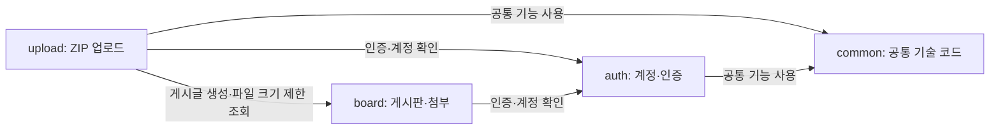

# Spring Modulith로 나눈 백엔드 구조

이 백엔드는 **하나의 Spring Boot 애플리케이션 안에서 코드를 기능별로 나누어 관리**합니다. 이렇게 나눈 코드 묶음을 **모듈**이라고 합니다. 로그인은 `auth`, 게시판은 `board`, ZIP 청크 업로드는 `upload`가 담당합니다.

이 프로젝트에서는 Spring Modulith로 각 모듈이 다른 모듈의 어떤 코드를 사용할 수 있는지 선언하고, 테스트로 규칙 위반을 확인합니다. 예를 들어 업로드 기능에서 게시글을 만들 때는 `board`가 공개한 생성 기능을 호출해야 합니다.

모든 모듈은 함께 실행하고 배포합니다. 모듈끼리는 같은 애플리케이션 안에서 Java 메서드를 호출하며, 하나의 PostgreSQL 데이터베이스를 사용합니다.

## 1. 어떤 코드를 어디에서 찾나요?

백엔드 코드의 기준 경로는 `back/src/main/java/com/llm/app/`입니다.

| 모듈 | 담당하는 일 | 처음 읽어볼 파일 |
| --- | --- | --- |
| `auth` | 로그인, 로그인 토큰(JWT) 검증, 계정·역할 관리 | [AuthController.java](../back/src/main/java/com/llm/app/auth/internal/AuthController.java) |
| `board` | 게시글·댓글, 첨부파일 정보와 실제 파일의 저장·삭제 | [BoardPostController.java](../back/src/main/java/com/llm/app/board/controller/BoardPostController.java) |
| `upload` | ZIP을 나눠 보낸 조각(청크) 수신, 업로드 진행 상태 관리, 파일 복원·검증, 완료 처리, 실패 기록·만료 정리 | [UploadSessionController.java](../back/src/main/java/com/llm/app/upload/controller/UploadSessionController.java) |
| `common` | 암호화 키 생성에 쓰는 공통 계산, 설정, 서버 상태 확인(health), CORS, 공통 오류 응답 형식 | [common 폴더](../back/src/main/java/com/llm/app/common) |

최상위 `com.llm.app` 패키지에는 서버를 시작하고 스케줄링을 켜는 `LlmApplication`과, 오류를 HTTP 응답으로 바꾸는 `GlobalExceptionHandler`가 있습니다. 이 문서에서는 이 최상위 영역을 **root**라고 부릅니다.

`board`에 남아 있는 AI 관련 코드는 기존 답변 조회·보호 등을 위한 코드입니다. AI 답변 생성 기능은 종료되었습니다.

## 2. 모듈끼리 어떻게 연결되나요?

아래 그림에서 **`A → B`는 A의 코드가 B의 공개 기능을 사용한다**는 뜻입니다. 요청이 처리되는 순서를 나타내는 그림은 아닙니다.



예를 들어 `upload`는 업로드를 마치면 `board`에 게시글 생성을 요청합니다. 반대 방향의 참조는 허용하지 않으므로 `board` 코드에서 `upload`의 클래스를 가져다 쓰면 안 됩니다.

`common`에는 특정 업무와 관계없는 기술 코드를 둡니다. 게시글 수정 권한 같은 업무 규칙은 담당 모듈인 `board`에 둡니다. `common`은 다른 업무 모듈을 참조하지 않습니다.

root의 오류 처리 연결은 그림에서 생략했으며, 정확한 허용 목록은 5절에 있습니다.

## 3. 다른 모듈의 기능은 어떻게 사용하나요?

각 모듈은 다른 모듈이 사용할 수 있는 **공개 계약**을 제공합니다. 공개 계약은 호출할 메서드, 입력값, 반환값, 전달할 오류를 정한 코드입니다. 실제 처리 방법은 그 모듈 내부에 둡니다.

이 문서의 `auth.api` 같은 패키지 이름에서 `api`는 Java 코드의 공개 사용 창구를 뜻합니다. 웹에서 호출하는 `/api/v1/...` 주소와는 구분해서 읽으면 됩니다.

### 인증·계정 확인: `auth.api`

| 필요한 작업 | 사용할 메서드 | 반환하는 값 |
| --- | --- | --- |
| 요청의 로그인 토큰 검증 | `AuthenticationGateway.authenticate(authHeader)` | 인증된 계정 ID |
| 계정 존재 확인과 정보 조회 | `IdentityAccess.requireUser(userId)` | 계정 ID·이름·역할을 담은 `AuthenticatedUser` |

`board`와 `upload`의 인증이 필요한 컨트롤러는 `AuthenticationGateway`를 주입받아 호출합니다. 서비스에서 계정 정보가 필요하면 `IdentityAccess`를 사용합니다. 역할은 `UserRole`로 표현하며, 인증·권한 오류를 전달하는 `InvalidCredentialsException`과 `ForbiddenException`도 공개 계약에 포함됩니다.

JWT를 실제로 해석하는 `JwtProvider`와 계정 DB 조회를 담당하는 `AdminRepository`는 `auth.internal`에 있습니다. 다른 모듈은 이 구현에 직접 접근하지 않습니다.

### 업로드 결과를 게시글로 저장: `board.api.upload`

| 필요한 작업 | 사용할 메서드 | 반환하는 값 |
| --- | --- | --- |
| 최종 ZIP 파일의 최대 허용 크기 확인 | `GeneratedAttachmentPolicy.getMaxGeneratedFileSizeBytes()` | 바이트 단위 크기 제한 |
| 복원한 ZIP으로 게시글·첨부 생성 | `UploadedPostCreator.create(command)` | 생성된 게시글·첨부 정보를 담은 `UploadedPostCreationResult` |

`UploadedPostCreationCommand`는 제목, 본문, 복원한 임시 ZIP 경로, 작성자 정보 등을 담는 입력 객체입니다. `upload`는 이 값을 전달하고, `board`가 게시글과 영구 보관할 첨부파일을 저장합니다.

예를 들어 `upload`에서 클래스를 가져올 때는 다음처럼 구분합니다.

```java
// 사용 가능: board가 공개한 게시글 생성 기능
import com.llm.app.board.api.upload.UploadedPostCreator;

// 사용 금지: board 내부의 DB 저장 코드를 직접 가져옴
import com.llm.app.board.repository.BoardPostRepository;
```

이렇게 하면 `board`의 DB 저장 방식이 바뀌어도, 공개 계약을 유지하는 한 `upload`의 호출 코드를 그대로 사용할 수 있습니다. DB 테이블과 연결된 객체(JPA 엔티티)나 모듈 내부의 요청·응답 객체(DTO)는 다른 모듈에 넘기지 않습니다.

## 4. 예시: ZIP 업로드가 게시글이 되기까지

ZIP 업로드는 **세션 생성 → 청크 전송 → 완료 요청(`finalize`)** 순서로 진행합니다. 세션은 업로드 한 건의 소유자, 파일 정보, 진행 상태를 관리하는 기록입니다.

1. **업로드를 시작합니다.** 클라이언트가 `upload`에 세션 생성을 요청합니다. `upload`는 `auth`로 인증·계정을 확인하고, `board`의 `GeneratedAttachmentPolicy`로 최대 파일 크기를 확인합니다.
2. **청크를 보냅니다.** 클라이언트가 ZIP을 나누어 전송합니다. `upload`가 세션 소유자를 확인하고 청크 파일과 수신 기록을 저장합니다.
3. **완료를 요청합니다.** 클라이언트가 `finalize`를 호출하면 `upload`가 인증·계정, 세션 소유자와 상태, 청크 누락 여부를 확인합니다.
4. **원본 ZIP을 복원합니다.** `upload`가 청크를 합쳐 임시 ZIP을 만들고, 파일 크기와 해시(내용이 일치하는지 확인하는 값)를 검사합니다.
5. **게시글과 첨부를 저장합니다.** `upload`가 `UploadedPostCreator.create(...)`를 호출합니다. `board`가 게시글, 첨부 정보(파일명·크기·저장 경로 등), 영구 첨부파일을 저장하고 결과를 돌려줍니다.
6. **업로드를 정리합니다.** `upload`가 세션·청크 DB 기록을 삭제합니다. DB 변경이 확정된 뒤 임시 디렉터리를 정리하고 클라이언트에 게시글 결과를 응답합니다.

역할을 나누는 기준은 **업로드 중인 임시 데이터는 `upload`, 게시판에서 계속 사용할 데이터는 `board`**입니다.

게시글·첨부 정보 저장과 세션·청크 기록 삭제는 하나의 **트랜잭션**으로 처리합니다. 즉, 이 DB 변경은 함께 확정되거나 함께 취소됩니다. `UploadedPostCreator` 호출도 이 트랜잭션에 참여합니다.

파일은 DB 변경 취소만으로 복구되지 않으므로 별도 정리가 필요합니다.

- DB 변경이 취소되면(롤백) 이번에 복원한 임시 ZIP과 새로 만든 영구 첨부파일을 정리합니다.
- 기존 첨부를 삭제할 때는 DB에 삭제할 파일을 함께 기록하고, DB 변경이 확정된 뒤(커밋) 실제 파일을 삭제합니다. 파일 삭제가 실패하면 재시도합니다.

## 5. 코드에 선언된 규칙은 어떻게 읽나요?

각 모듈의 `package-info.java`에 경계 규칙이 있습니다.

| 코드에 나오는 표현 | 뜻 |
| --- | --- |
| `@ApplicationModule(allowedDependencies = ...)` | 이 모듈이 사용할 수 있는 다른 모듈의 범위 |
| `@NamedInterface("이름")` | 다른 모듈에 공개할 패키지에 붙인 이름 |
| `auth :: api` | `auth`가 `api`라는 이름으로 공개한 `auth.api` 패키지 |
| `board :: upload` | `board`가 `upload`라는 이름으로 공개한 `board.api.upload` 패키지 |

현재 선언된 허용 목록은 다음과 같습니다. 이 목록에 없는 방향으로 다른 모듈을 참조할 수 없습니다.

| 사용하는 쪽 | 사용이 허용된 대상 |
| --- | --- |
| root (`com.llm.app`) | `auth :: api`, `auth :: web`, `board :: web`, `upload :: web`, `common :: web` |
| `auth` | `common` |
| `board` | `auth :: api` |
| `upload` | `auth :: api`, `board :: upload`, `common` |
| `common` | 없음 |

`auth`, `board`, `upload`의 `web`은 각 모듈의 `exception` 패키지에 붙인 공개 이름입니다. `common :: web`은 `common.web` 패키지입니다. root의 `GlobalExceptionHandler`는 공개된 오류와 `ErrorResponse`를 사용해 일관된 HTTP 오류 응답을 만듭니다. 여기서 `web`은 모듈의 모든 컨트롤러를 공개한다는 뜻이 아닙니다.

목록의 `common`처럼 공개 이름이 따로 없으면 해당 모듈의 기본 공개 영역을 뜻합니다. 모든 하위 패키지에 접근할 수 있다는 뜻은 아닙니다.

## 6. 코드를 수정할 때 확인할 것

- **담당 모듈에 구현했는지 확인합니다.** 로그인·계정은 `auth`, 게시판·영구 첨부는 `board`, 업로드 진행·복원은 `upload`가 맡습니다.
- **다른 모듈의 공개 계약을 사용했는지 확인합니다.** 다른 모듈의 `internal`, `controller`, `service`, `repository`, `model`, `dto` 등 내부 패키지를 직접 import하지 않습니다.
- **모듈 경계 검증을 통과하는지 확인합니다.** [ApplicationModulesDiagnosticTest.java](../back/src/test/java/com/llm/app/review/ApplicationModulesDiagnosticTest.java)가 `ApplicationModules.of(LlmApplication.class).verify()`로 규칙 위반을 검사합니다. 검증을 끄거나 모듈을 `open`으로 바꿔 검사를 우회하지 않습니다.

모듈 경계만 빠르게 확인하려면 저장소 루트에서 다음 명령을 실행합니다. Windows PowerShell 기준입니다.

```powershell
cd back
.\gradlew.bat test --tests com.llm.app.review.ApplicationModulesDiagnosticTest
```

이 검사는 코드 구조를 확인합니다. 백엔드 기능을 변경했다면 전체 테스트인 `.\gradlew.bat clean test`도 통과해야 합니다.

관련 세부사항은 [전체 실행 구조](04-architecture.md), [HTTP API와 오류 코드](07-api-reference.md), [ZIP 업로드 도구·전송 형식](08-upload-session-tool.md), [첨부파일 일관성 검증](18-integrity-hardening.md)을 참고하세요.
