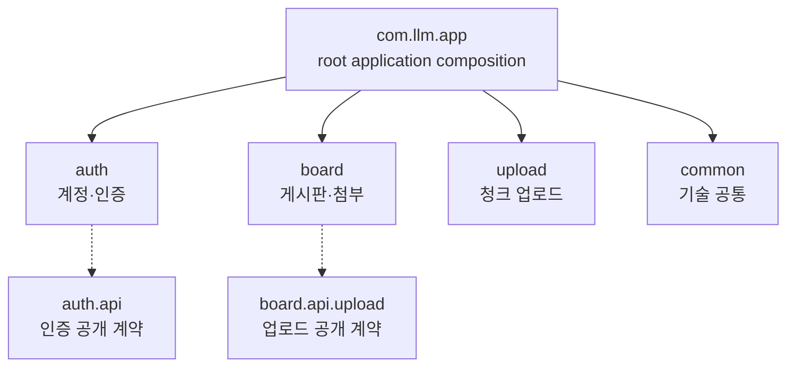
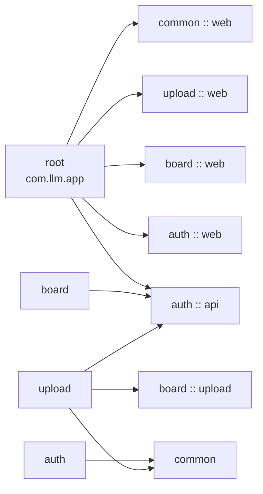
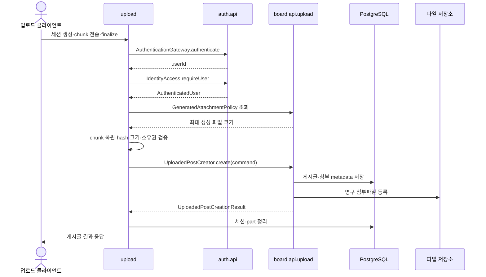

# Spring Modulith 모듈 구조 지도

이 문서는 현재 백엔드 코드의 Spring Modulith 경계와 모듈 간 호출 방향을 한눈에 보여주는 지도다. 기준 구현은 `back/src/main/java/com/llm/app/**/package-info.java`의 `@ApplicationModule`·`@NamedInterface` 선언이며, `ApplicationModulesDiagnosticTest`의 엄격한 `ApplicationModules.of(LlmApplication.class).verify()`가 이 경계를 검증한다.

Spring Modulith를 적용했지만 배포 단위는 여전히 하나의 Spring Boot 프로세스다. 아래 모듈 간 호출은 같은 JVM 안의 동기적인 Bean 호출이며, 모듈별 HTTP 서비스·메시지 브로커·별도 데이터베이스를 뜻하지 않는다.

## 모듈 책임과 공개 계약

| 모듈 | 소유 책임 | 다른 모듈에 공개하는 계약 | 허용된 외부 의존 방향 |
| --- | --- | --- | --- |
| `com.llm.app` (root) | `LlmApplication` 기동·스케줄링 활성화, 전역 `GlobalExceptionHandler`와 애플리케이션 조립 | 없음. 각 모듈의 공개 계약을 애플리케이션 경계에서 조립 | `auth :: api`, `auth :: web`, `board :: web`, `upload :: web`, `common :: web`만 참조 |
| `auth` | 로그인·JWT 검증, 계정·역할·관리, 계정 Repository와 엔티티 | `auth.api` (`AuthenticationGateway`, `IdentityAccess`, 인증 값 객체·공개 예외), `auth.exception`의 `web` 오류 계약 | `common`만 참조; `board`·`upload`는 참조하지 않음 |
| `board` | 게시글·댓글·첨부 metadata, 영구 첨부파일 생명주기, 게시판 HTTP API 및 레거시 AI 답변 보호 | `board.api.upload` (`UploadedPostCreator`, 생성 명령/결과, `GeneratedAttachmentPolicy`), `board.exception`의 `web` 오류 계약 | `auth :: api`만 참조; `upload`·`common`은 참조하지 않음 |
| `upload` | 청크·업로드 세션 상태, 암호화 wire codec, 임시 파일 복원, hash/크기 검증, finalize·실패 기록·만료 정리 | `upload.exception`의 `web` 오류 계약을 root 조립에 제공 | `auth :: api`, `board :: upload`, `common`만 참조 |
| `common` | 업무 의미가 없는 기술 공통 코드, key derivation·설정, health/CORS·공통 HTTP 응답 | `common :: web` (`HealthController`, `ErrorResponse` 등) | 업무 모듈을 참조하지 않음 |

`auth.internal`, `board.controller`·`service`·`repository`·`model`, `upload.controller`·`service`·`repository`·`model`은 각 모듈의 내부 구현이다. 외부 모듈이 이 내부 Repository·JPA entity·mapper·DTO를 직접 가져오지 않도록 한다.

### 공개 계약: `auth.api`

`auth.api`는 `@NamedInterface("api")`로 선언된 계정·인증 계약이다.

- `AuthenticationGateway.authenticate(String authHeader)`는 Bearer 헤더를 검증하고 현재 계정 ID를 반환한다.
- `IdentityAccess.requireUser(Long userId)`는 계정 존재를 확인하고 `AuthenticatedUser`를 반환한다.
- `AuthenticatedUser`와 `UserRole`은 다른 모듈이 필요한 계정 식별·표시명·역할 값만 전달한다.
- `InvalidCredentialsException`과 `ForbiddenException`은 외부 모듈에서 사용할 수 있는 인증·권한 오류 계약이다.
- JWT 파싱·서명·token version 검증의 구현인 `JwtProvider`, 계정 entity·`AdminRepository`는 `auth.internal`에 남는다.

따라서 `board`·`upload`의 보호 컨트롤러는 `JwtProvider`를 직접 호출하지 않고 `AuthenticationGateway`를 주입받는다. 계정 조회가 필요한 서비스도 `IdentityAccess`를 사용하며 `Admin` entity를 직접 참조하지 않는다.

### 공개 계약: `board.api.upload`

`board.api.upload`는 `@NamedInterface("upload")`로 선언된 게시판-업로드 연결 계약이다.

- `UploadedPostCreator.create(UploadedPostCreationCommand)`는 검증된 업로드 결과를 게시글과 첨부 metadata로 등록하고 `UploadedPostCreationResult`를 반환한다.
- `GeneratedAttachmentPolicy.getMaxGeneratedFileSizeBytes()`는 업로드 세션 생성 단계에서 사용할 board 소유의 최종 생성 파일 크기 제한을 제공한다.
- `UploadedPostCreationCommand`·`UploadedPostCreationResult`는 호출에 필요한 값과 결과만 전달한다. JPA entity, Repository, 내부 mapper는 계약에 포함하지 않는다.
- finalize가 만드는 조립 경로는 upload가 검증·관리하는 임시 결과이며, board는 공개 생성 계약을 통해서만 영구 첨부로 등록한다.

`upload`에서 `board`로 향하는 호출은 이 named interface를 통한 단방향 호출이다. `board`는 `upload`를 알지 못하므로 게시판 일반 기능과 업로드 완료 오케스트레이션이 서로 역참조하지 않는다.

## 모듈 구성

위 그림은 패키지 소유권을 나타낸다. 점선으로 표시한 `auth.api`와 `board.api.upload`는 각각 `auth`·`board`가 소유하지만 외부 호출자에게 공개한 named interface다. `common`은 재사용 가능한 기술 코드만 담고 업무 규칙의 소유자가 아니다.

## 허용 의존 방향

아래 방향은 `package-info.java`에 선언된 실제 허용 목록이다. 화살표가 없는 역방향 참조와 내부 하위 패키지 직접 접근은 허용하지 않는다.

- `root`는 HTTP 예외를 전역 응답으로 조립하기 위해 각 모듈의 공개 `web` 예외 계약과 `common :: web` 응답 타입을 참조하고, 애플리케이션 조립을 위해 `auth :: api`를 참조한다.
- `auth`는 `common`만 참조한다. 계정 모듈은 게시판·업로드를 알지 않는다.
- `board`는 인증·계정이 필요한 부분을 `auth :: api`로만 호출한다. 게시판은 `common`이나 upload 내부 구현을 참조하지 않는다.
- `upload`는 인증·계정 확인에 `auth :: api`, 게시글 생성·생성 첨부 정책에 `board :: upload`, 암호화 키 파생 등 기술 공통 기능에 `common`을 사용한다.
- `common`은 다른 업무 모듈을 참조하지 않는다.

이 의존 방향의 실행 검증은 `back/src/test/java/com/llm/app/review/ApplicationModulesDiagnosticTest.java`에 있다. 검증을 끄거나 `open` 모듈로 선언해 위반을 우회하지 않는다.

## 공개 계약을 통과하는 ZIP finalize 흐름

ZIP 업로드의 완료 경로는 `upload`가 오케스트레이션하고, 게시글·영구 첨부의 저장은 `board`가 소유한다.

`AuthenticationGateway`는 upload controller에서 인증 진입점으로 사용되고, `IdentityAccess`와 `GeneratedAttachmentPolicy`는 upload service가 검증 과정에서 사용한다. `UploadedPostCreator` 호출은 별도 HTTP 요청이 아니라 같은 Spring 트랜잭션에 참여하는 Bean 호출이다.

finalize에서 `upload`가 소유하는 것은 세션 row·chunk row·임시 복원 파일이다. `board`가 소유하는 것은 게시글·댓글·첨부 metadata와 영구 첨부파일이다. 게시글 생성, 첨부 metadata, 세션 상태 정리는 기존 트랜잭션 원자성을 유지해야 하며, 커밋 이후 임시 디렉터리를 정리한다. 신규 영구 파일은 롤백 시 정리하고, 기존 첨부 삭제는 DB 커밋 후 수행한다.

## 경계에서 지켜야 할 규칙

1. 다른 모듈의 `internal`, `controller`, `dto`, `model`, `repository`, `service` 패키지를 직접 import하지 않는다.
2. 계정 인증·조회는 `auth.api` 계약을 사용한다. `JwtProvider`·`AdminRepository`·`Admin` entity를 board/upload에 노출하지 않는다.
3. 업로드 완료가 게시판 저장을 호출할 때는 `board.api.upload` 계약과 값 객체만 사용한다. board의 repository·entity·mapper를 upload에 전달하지 않는다.
4. 게시판은 upload에 의존하지 않는다. 업로드 도구가 없어도 게시판 조회·일반 게시글 API의 소유 경계가 바뀌지 않는다.
5. 공통 코드로 옮길 때는 업무 규칙이 없는 기술 코드인지 확인한다. `common`이 업무 모듈을 참조하는 방향으로 커지지 않게 한다.
6. HTTP 오류 응답은 root `GlobalExceptionHandler`가 모듈의 공개 `web` 오류 계약과 `common :: web` 응답 타입을 조립한다. 모듈 간 내부 웹 DTO를 공유하지 않는다.

이 문서는 모듈 경계를 설명하는 구조 지도이며 API 경로·JSON wire format·업로드 암호화 포맷을 정의하는 문서가 아니다. HTTP 엔드포인트와 오류 코드는 [API 레퍼런스](07-api-reference.md), 업로드 wire 절차는 [ZIP 청크 업로드 도구](08-upload-session-tool.md), 전체 런타임 구성은 [아키텍처](04-architecture.md)를 기준으로 한다.
