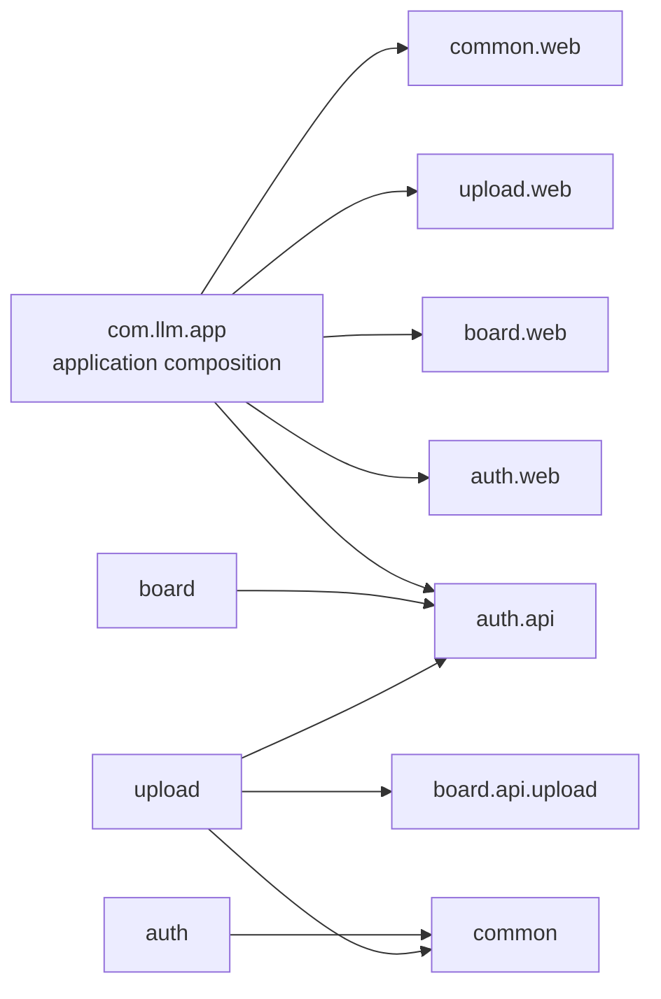

# Spring Modulith 기반 모듈형 모놀리스 전환 계획서

- 상태: 구현 완료 — Phase 0~8 완료, Phase 8의 격리 환경 인증 ZIP HTTP smoke까지 검증 완료 (PostgreSQL finalize 시나리오 (b)는 미커버)
- 작성일: 2026-09-07
- 최종 갱신: 2026-09-08
- 대상: `back/` Spring Boot 백엔드
- 기준: 로컬 소스의 패키지·의존성·업로드 완료 흐름과 저장소 운영 규칙
- 현재 기술: Spring Boot 3.5.11, Java 25, JPA, PostgreSQL, Flyway
- 목적: 하나의 애플리케이션을 유지하면서 업무 경계와 공개 계약을 명확히 하고, 경계 위반을 테스트로 검출한다.

이 문서는 구현 결과와 검증 기록으로 갱신한 계획서다. Spring Modulith 의존성·패키지 경계·공개 계약·업로드 회귀 테스트가 로컬 작업 트리에 반영되었고, 엄격한 `ApplicationModules.verify()`가 통과했다. `auth` 패키지는 `identity`로 이름을 바꾸지 않고 `api`/`internal` 하위 패키지로 정리했다. 2026-09-08 최신 소스로 백엔드 이미지를 다시 빌드한 뒤 compose를 기동해 back/front health, front proxy의 8083 health와 게시글 목록 조회를 확인했으며, 별도 격리 환경에서 실제 HTTP 로그인·ZIP 업로드·다운로드 smoke도 성공했다. 기존 서비스에 영향을 주지 않도록 격리 컨테이너·네트워크·볼륨은 검증 후 제거하고 원본 front 네트워크를 복원했다.

이 문서의 완료 표시는 코드와 실제 검증 결과에만 근거한다. 확인하지 못한 PostgreSQL finalize 시나리오 (b)는 완료로 기록하지 않는다.

## 1. 추진 배경과 기대 효과

전환 전 백엔드는 `auth`, `board`, `common` 패키지로 구분되어 있었지만, 계정 Repository를 게시판·업로드에서 직접 사용하고 업로드 완료 로직도 게시글·첨부 저장을 직접 수행했다. 아래 구현 결과는 이 결합을 공개 계약과 모듈 소유권으로 정리한 내용이다.

Spring Modulith를 활용해 다음을 개선한다.

1. 계정·게시판·업로드의 책임과 의존 방향을 명확히 한다.
2. 다른 모듈의 Repository·JPA 엔티티를 직접 사용하는 경로를 공개 서비스 계약으로 바꾼다.
3. 순환 의존, 내부 패키지 접근, 허용되지 않은 모듈 참조를 빌드 과정에서 검출한다.
4. 기존 API 동작과 데이터 일관성을 유지하면서 모듈별 변경 영향을 줄인다.
5. 실제 코드에서 모듈 구조 문서를 생성해 설계와 구현의 차이를 줄인다.

목표는 구조와 유지보수성 개선이다. 처리 속도 향상이나 MSA 전환을 성과로 전제하지 않는다. 모듈형 모놀리스를 최종 운영 구조로 유지할 수 있다.

## 2. 범위

### 포함

- Spring Modulith 의존성과 구조 검증 테스트 도입
- 단일 Gradle 프로젝트 안에서 패키지 기반 모듈 구성
- 계정·게시판·업로드의 공개 API와 내부 구현 구분
- 모듈 간 직접 Repository·엔티티 의존 제거
- 전역 예외 처리와 공통 코드의 의존 방향 정리
- 기존 보안·업로드·첨부 기능의 회귀 검증
- 모듈 구조와 개발 규칙 문서화

### 이번 전환에서 제외

- MSA, 별도 서비스 프로세스, Gradle 멀티 프로젝트 전환
- Kafka·Temporal·Kubernetes 도입
- 모듈 간 호출의 일괄 비동기 이벤트 전환
- API 경로·요청/응답 계약·업로드 암호화 포맷 변경
- DB 분리·스키마 변경·기존 Flyway SQL 수정
- 프론트 기능 변경, AI 답변 생성 기능 재개
- 인증을 Spring Security filter chain으로 이전하는 작업

모듈 간 호출은 필요한 경우 같은 JVM의 Spring Bean을 동기 호출한다. 이벤트가 필요한 후속 기능은 별도 설계로 다룬다.

## 3. 구현 결과와 확인한 경계

| 구현 영역 | 결과 |
| --- | --- |
| `auth` | 계정·인증 모듈 이름은 유지하고 `auth.api` 공개 계약과 `auth.internal` 엔티티·Repository·JWT·컨트롤러·관리 서비스를 분리했다. 계정 웹 예외는 `auth.exception`에 둔다. |
| `board` | 게시글·댓글·첨부·영구 파일 생명주기를 소유한다. `board.api.upload` named interface로 업로드 결과 게시글 생성과 생성 첨부 크기 정책을 공개한다. |
| `upload` | 청크·세션·복원·wire codec·실패 기록·만료 정리와 업로드 컨트롤러를 소유한다. `auth.api`와 `board.api.upload`만 사용해 계정 확인과 게시판 생성 계약을 호출한다. |
| 전역 웹 조립 | 루트 `com.llm.app.GlobalExceptionHandler`가 auth·board·upload의 공개 예외와 공통 HTTP 예외를 응답으로 조립한다. |
| 공통 코드 | `common`은 업무 모듈을 참조하지 않는 기술 공통 영역으로 유지한다. |
| 구조 검증 | `ApplicationModulesDiagnosticTest`에서 `ApplicationModules.of(LlmApplication.class).verify()`를 엄격하게 실행하며 통과했다. |

이 구현은 계획서의 `identity` 이름 변경을 수행하지 않았다. 실제 계정 모듈의 식별자는 계속 `auth`이며, 외부 모듈은 `auth.api`만 참조한다. 업로드 모듈은 실제로 존재하고, 게시판 내부 저장소·엔티티·Mapper를 업로드 모듈이 직접 참조하지 않는 방향으로 정리했다.

기존 패키지 이동으로 인한 JPQL 문자열 참조는 실제 소스에서 갱신했으며, 전체 H2 테스트와 게시판 목록·상세 관련 회귀 테스트로 컨텍스트 및 조회 동작을 확인한다.

## 4. 구현된 모듈 구성

```text
com.llm.app
├─ LlmApplication
├─ auth                     계정·인증 모듈 (이름은 유지)
│  ├─ api                   다른 모듈이 사용하는 인증·계정 공개 계약
│  ├─ internal              엔티티·Repository·JWT·컨트롤러·관리 서비스
│  └─ exception             계정 웹 오류 계약
├─ board                    게시판·첨부 모듈
│  ├─ api.upload             업로드 모듈이 사용하는 게시글 생성·생성 첨부 정책 계약
│  ├─ controller/dto/...     게시판 HTTP API와 내부 DTO·도메인·Repository
│  ├─ exception              게시판 웹 오류 계약
│  └─ service                게시글·댓글·첨부·파일 삭제 처리
├─ upload                   업로드 모듈
│  ├─ controller/dto/...     업로드 HTTP API와 wire 모델
│  ├─ model/repository       세션·청크 상태 저장
│  ├─ service                청크·복원·wire codec·실패 기록·만료 정리
│  └─ exception              업로드 웹 오류 계약
└─ common                   업무 모듈이 참조하지 않는 공통 기술 코드
```

`auth` 명칭은 실제 구현에서 유지했다. 계정 모듈의 애플리케이션 패키지 이름은 `auth`이며 `auth.api`와 `auth.internal`로 공개 계약과 내부 구현을 나눈다. `identity`는 이 계획서의 이전 목표안 명칭일 뿐 현재 모듈 이름이 아니다.

`board.api.upload`는 `UploadedPostCreator`, 생성 명령·결과, `GeneratedAttachmentPolicy`를 `upload`에 공개하는 named interface다. `upload`의 컨트롤러·서비스는 `auth.api`와 `board.api.upload`만 사용해 인증·계정 확인과 게시판 생성 계약을 호출하며, `board` 내부 Repository·엔티티·Mapper·`AttachmentStorageService`에 직접 접근하지 않는다. `auth`는 다른 업무 모듈을 참조하지 않고, `common`은 업무 모듈을 참조하지 않는다.

컨트롤러·모듈 고유 예외 처리기는 해당 모듈 내부에 둔다. 모듈 내부 HTTP DTO는 다른 모듈에 무조건 공개하지 않는다. 내부 모듈 API는 Java 호출 계약이며 외부 HTTP 엔드포인트 추가를 뜻하지 않는다.

Health·CORS·일반 HTTP 오류 처리처럼 애플리케이션 전체에 적용되는 코드는 루트 `com.llm.app`에 둔다. `GlobalExceptionHandler`는 루트 `@RestControllerAdvice`로 auth·board·upload의 공개 오류와 공통 Spring/Jakarta 오류를 HTTP 응답으로 조립하며, 업무 모듈이 서로의 내부 웹 타입을 참조하도록 만들지 않는다. 엄격한 `ApplicationModules.of(LlmApplication.class).verify()`가 이 모듈 경계와 허용 의존 방향을 검증한다.

### 구현된 의존 방향



- 루트 조립 영역은 각 모듈의 named interface인 `auth :: api`, `auth :: web`, `board :: web`, `upload :: web`, `common :: web`을 참조하며, `board`는 `common`도 참조하지 않는다. 루트 `GlobalExceptionHandler`가 각 모듈의 공개 web 오류와 `common.web` 응답 타입을 조립한다.
- `auth`는 `common`만 참조하고 `board`·`upload`를 참조하지 않는다.
- `board`는 `auth :: api`만 외부 모듈 계약으로 참조하고, 첨부·게시글 저장을 소유한다.
- `upload`는 `auth :: api`, `board :: upload`, `common`을 참조한다. `board`가 `upload`를 참조하는 방향은 없다.
- `common`은 다른 업무 모듈을 참조하지 않는다.
- DB는 하나를 유지하되 `admins`·게시판·첨부 Repository는 auth/board가, 업로드 세션 Repository는 upload가 각각 소유한다.

`auth`의 공통 인증·권한 오류와 board/upload 오류는 루트 `GlobalExceptionHandler`가 전역적으로 처리한다. 최종 `Exception` 처리기와 구체 예외 매핑이 함께 등록되어 있으며, 기존 HTTP 상태·오류 코드·응답 형식을 전체 회귀 테스트로 유지했다.

## 5. 공개 계약 구현 결과

**상태: 완료**

`IdentityAccess`, 인증 진입점, `UploadedPostCreator`, `GeneratedAttachmentPolicy`를 구현된 공개 계약으로 확정했고 HTTP 요청/응답·upload wire format은 변경하지 않았다.

| 계약 | 책임 | 경계에서 제외할 것 |
| --- | --- | --- |
| `IdentityAccess` | 계정 존재 확인, 사용자 ID·표시명·역할 반환 | `Admin` 엔티티, `AdminRepository`, 비밀값 |
| 인증 공개 진입점 | 컨트롤러가 JWT와 계정 존재 여부를 검증 | 토큰 파싱 구현에 대한 외부 직접 접근 |
| `UploadedPostCreator` | 검증된 업로드 결과로 게시글·첨부를 함께 등록 | 게시글·첨부 Repository, 내부 Mapper |
| `GeneratedAttachmentPolicy` | `board`가 소유한 최대 생성 첨부 크기를 바이트 단위 값으로 조회 | `AttachmentStorageService`, 내부 설정 Bean, 파일 저장 구현 |
| 업로드 결과 값 객체 | 생성된 게시글 ID 등 호출자가 필요한 결과 전달 | 지연 로딩되는 JPA 엔티티 |

`board.api.upload`는 `UploadedPostCreator`와 `GeneratedAttachmentPolicy`를 `upload`에 공개하는 named interface다. `upload`는 이 계약을 호출해 게시판 생성과 생성 첨부 크기 정책을 사용하며, board 내부 DTO·Repository·엔티티·Mapper에 직접 의존하지 않는다.

복원 파일 전달은 구현에서 검증된 임시 `Path`, 원본 파일명, 사용자 ID 등을 포함하는 `UploadedPostCreationCommand`로 확정했다. 클라이언트가 지정한 임의 경로를 받는 API는 만들지 않는다.

### 세션 생성 단계의 첨부 크기 정책

`board`는 `GeneratedAttachmentPolicy`로 `APP_ATTACHMENTS_MAX_GENERATED_FILE_SIZE`에 대응하는 제한값을 공개하며, `upload`는 세션 생성 단계에서 이 계약을 조회한다. `GeneratedAttachmentPolicyTest`는 설정값 노출과 제한 바로 아래·동일·초과 저장 경계를 검증한다. 초과 요청은 세션·파일을 만들지 않고 기존 400 / `INVALID_UPLOAD_SESSION_REQUEST` 계약을 유지한다.

## 6. 반드시 보존할 동작

### 인증·권한

- `auth` 외부 모듈의 보호 컨트롤러는 공개 계약인 `AuthenticationGateway.authenticate`를 호출하고, `auth.internal`의 `JwtProvider` 구현이 JWT·계정 존재 여부를 검증하는 공통 인증 진입점을 유지한다. auth 내부 컨트롤러의 직접 `JwtProvider` 사용은 허용하며, 클래스 이동 시에도 외부 모듈이 내부 구현을 직접 참조하지 않도록 한다.
- JWT subject의 계정 ID와 `tokenVersion=2`, 고정 만료 동작을 유지한다.
- 게시글·댓글 수정/삭제는 작성자 본인 또는 ADMIN만 허용한다.
- 작성자 ID가 null인 레거시 데이터는 ADMIN만 관리한다.
- 일괄 삭제는 대상 전체의 권한을 확인하고, 실패 시 부분 삭제하지 않는다.
- 업로드 소유권과 계정 삭제 후 접근 차단을 유지한다.
- 기존 HTTP 상태 코드·오류 코드와 인증 오류 처리 계약을 유지한다.

### 업로드 완료·첨부 일관성

구현된 `finalizeSession`은 게시글·첨부 저장과 세션 행 정리를 같은 트랜잭션에서 수행하고, 커밋 후 세션 디렉터리를 정리한다. 조립 대상 경로를 만든 직후 정리 콜백을 등록하여, 커밋 후 세션 디렉터리를 삭제하고 롤백 시 조립 파일을 삭제한다. finalize 본문에서 예외가 나면 `catch`는 `UploadSessionFailureService.markFailed`를 직접 호출하지 않고 실패 기록 콜백을 등록한 뒤 원래 예외를 재전파한다. 기존 트랜잭션이 롤백된 뒤 `afterCompletion`에서 `REQUIRES_NEW` 트랜잭션으로 `FAILED`를 기록한다. 메서드 본문 반환 이후 실제 commit 실패는 이 `catch`를 거치지 않으며, 검증된 경로에서는 세션이 `PENDING`으로 복원되고 원본 chunk가 유지된다.

PostgreSQL focused 검증은 이 경계를 다음과 같이 확인했다. (a) 게시판 생성 후 `EntityManager.flush()` 뒤 본문 실패는 원래 예외·롤백·`FAILED` 세션·원본 chunk 보존·조립 파일 정리와 제한 시간 내 종료를 확인했다. (c) deferrable delete trigger로 실제 commit 단계 실패를 유도해 commit 예외 전파, 롤백, `PENDING` 세션·원본 chunk 보존과 조립 파일 정리를 확인했다. (b) 세션·part 삭제를 명시적으로 flush한 뒤 본문 실패하는 지점은 해당 주입을 위한 production-only flush hook을 추가하지 않아 미커버로 남겼다.

`REQUIRES_NEW`는 외부 트랜잭션을 종료하지 않고 별도 트랜잭션을 사용한다. 따라서 flush 이후 실패와 별도 실패 기록의 잠금 상호작용은 구현·테스트 경계로 계속 구분한다. 모든 실패가 자동으로 `FAILED` 상태를 남긴다고 가정하지 않으며, 실제 결과는 시나리오별로 기록한다.

실제 구현 흐름은 다음과 같다.

1. `upload`가 사용자·소유권·세션·청크를 검증한다.
2. `upload`가 ZIP을 복원하고 크기·해시를 검증한다.
3. `upload`가 `board`의 공개 생성 API를 동기 호출한다.
4. `board`가 게시글·첨부 메타데이터를 저장하고, 신규 파일의 롤백 정리를 등록한다.
5. `upload`가 조립 대상 경로를 만든 직후 롤백 시 조립 파일 삭제·커밋 후 세션 디렉터리 삭제 콜백을 등록한다.
6. `upload`가 세션 행을 정리한다. 본문 실패 시 실패 기록 콜백을 등록하고 원래 예외를 재전파하며, 롤백 완료 후 `afterCompletion`의 `REQUIRES_NEW` 트랜잭션에서 세션을 `FAILED`로 기록한다. 메서드 반환 이후 commit 실패는 `catch`를 지나지 않아 세션이 `PENDING`으로 복원된다.
7. upload의 결과 매퍼가 board-detail-shaped JSON 응답을 만든다.

게시판 생성 API는 기존 트랜잭션에 참여하도록 설계한다. 모듈을 분리했다는 이유로 별도 커밋이나 비동기 실행을 추가하지 않는다. 게시글·첨부·세션 상태가 부분적으로 커밋되지 않는지 검증한다.

- 첨부 메타데이터 삭제와 `attachment_file_deletions` 등록을 같은 트랜잭션으로 유지한다.
- 실제 첨부파일 삭제는 커밋 이후 수행하며, 실패 시 기존 재시도 동작을 유지한다.
- 신규 첨부파일은 트랜잭션 롤백 시 정리한다.
- 실패 상태 기록의 트랜잭션 전파와 원래 예외 보존 동작을 확인한다. flush 이후 실패와 실제 커밋 실패는 8절의 PostgreSQL 시나리오로 검증하고, 요청이 정한 시간 안에 종료되는지 확인한다.
- Base64 청크, alias 키, AES-GCM wire format, 재개·만료 동작을 유지한다.
- `FILE_CONVERSION_REQUEST` 생성 제한과 AI 답변 보호·410 종료 응답을 유지한다.

## 7. Phase별 실행·중단·재개 계획

각 Phase를 독립적으로 검토하고 중단할 수 있는 작업 단위로 관리한다. 구현과 주요 통합 검증은 완료되었고, 아래 상태는 실제 코드·테스트 결과와 격리 환경에서 완료한 인증 ZIP smoke를 구분한다.

### 구현·검증 테스트

- `ApplicationModulesDiagnosticTest`로 실제 모듈 모델과 허용 의존을 검증한다.
- `GeneratedAttachmentPolicyTest`로 생성 첨부 크기 정책의 공개 계약과 제한 경계를 검증한다.
- `PostgresUploadFinalizeTest`로 disposable PostgreSQL에서 finalize 트랜잭션 경계를 검증한다.
- `PostgresMigrationTest`와 `PostgresUploadFinalizeTest`는 `LLM_TEST_POSTGRES_URL`이 설정된 조건부 테스트이며, 일반 `clean test`에서 변수가 없으면 각각 1개·2개가 skipped된다. PostgreSQL 환경을 제공한 focused 실행에서는 3개 모두 통과한다.

### 진행 현황
| --- | --- | --- | --- |
| 0 | 환경·기준선 확보 | 완료 | Java 25 경로를 지정한 전체 테스트와 별도 PostgreSQL 검증 환경을 확인했다. |
| 1 | 회귀 테스트 선행 작성 | 완료 | 인증·권한·업로드·첨부 파일 정리 회귀와 finalize 실패 경계 테스트를 추가·통과시켰다. |
| 2 | Modulith 도입·구조 진단 | 완료 | Spring Modulith BOM `1.4.13` 및 API/core 의존성을 도입하고 엄격한 `ApplicationModules.verify()`가 통과했다. |
| 3 | 계정 모듈 경계 정리 | 완료 | 이름은 `auth`로 유지하고 `auth.api`/`auth.internal`로 분리했으며 외부 직접 Repository 참조를 제거했다. |
| 4 | 공통 코드·웹 오류 처리 정리 | 완료 | 루트 `GlobalExceptionHandler`로 HTTP 오류 조립을 이동하고 전체 회귀 테스트가 통과했다. |
| 5 | 게시판 공개 API 도입 | 완료 | `board.api.upload` 공개 생성·정책 계약, `GeneratedAttachmentPolicyTest`, H2 회귀 및 PostgreSQL finalize 검증이 통과했다. |
| 6 | 업로드 모듈 분리 | 완료 | `upload` 모듈이 세션·청크·복원·wire codec을 소유하고 `auth.api`/`board.api.upload`만 사용한다. |
| 7 | 전체 경계 강제·문서화 | 완료 | `ApplicationModulesDiagnosticTest`가 일반 `clean test`에 포함되어 통과했고 관련 문서를 구현 결과에 맞게 갱신했다. |
| 8 | 최종 통합 검증 | 완료·인증 ZIP HTTP smoke 성공 | 전체 백엔드·focused PostgreSQL·최신 이미지 기동·back/front health·8083 health·게시글 목록 조회와 격리 환경의 실제 HTTP 로그인·암호화 청크 1건·finalize·다운로드를 통과했다. `m2-llm-back:smoke`(`sha256:8572eaceed6e2df0b9211d3bfdb47e67a7bfbe9ea644d570a2152086ac2d68ef`)와 `m2-llm-front:smoke`(`sha256:55f49492d323754df8972a4a6177771a16290154c75d68cc4f8e1e521ad61582`)를 사용했다. |

상태는 `미착수 / 진행 중 / 중단 / 차단 / 완료`로 기록한다. Phase 8은 격리 환경의 인증 ZIP smoke까지 성공해 완료로 기록한다. PostgreSQL finalize 시나리오 (b)는 별도 미커버 항목으로 유지한다.

### Phase 0 — 환경·기준선 확보

**상태: 완료**

- [x] Java 25 경로를 지정한 Gradle 실행 방법 확인
- [x] 리팩터링 전 회귀 기준선 확인
- [x] 기존 앱 DB와 분리된 disposable PostgreSQL 검증 환경 준비
- [x] 구현 시작 시점의 작업 트리와 이후 변경 범위 확인

**2026-09-08 최종 확인 결과**

- disposable PostgreSQL은 Docker 이미지 `postgres:1.0`으로 실행했고, 호스트 포트 `55432`에서 PostgreSQL 17.10으로 확인했다. 운영 문서의 stated production PostgreSQL 18과 다른 테스트 환경이다.
- `LLM_TEST_POSTGRES_URL`을 지정하면 PostgreSQL 전용 테스트가 활성화되고, 지정하지 않으면 해당 테스트는 조건부로 건너뛴다. 테스트는 전용 무작위 schema와 격리된 임시 파일 저장소를 사용한다.
- 최신 소스로 `llm-back:1.0`을 다시 빌드하고 compose를 기동했다. `llm-back`·`llm-front`가 healthy이며 `http://127.0.0.1:8083/api/v1/health`가 `status=UP`을 반환했고, `GET /api/v1/posts?page=1` 목록 조회도 성공했다.
- 후속 격리 환경에서 `m2-llm-back:smoke` sha256 `8572eaceed6e2df0b9211d3bfdb47e67a7bfbe9ea644d570a2152086ac2d68ef`와 `m2-llm-front:smoke` sha256 `55f49492d323754df8972a4a6177771a16290154c75d68cc4f8e1e521ad61582`로 실제 HTTP 로그인·AES-GCM alias 세션·암호화 청크 1건·finalize·다운로드를 성공했다. PostgreSQL 17, database `llm_m2_smoke`, schema `llm`, Flyway V1~V18이 모두 성공했고, 원본·다운로드 ZIP SHA-256과 바이트가 일치했다.

**최종 기록:** 테스트·컨테이너 health·공개 조회·인증 ZIP smoke 결과를 모두 기록했다. 비밀번호·토큰·secret은 기록하지 않는다.

### Phase 1 — 회귀 테스트 선행 작성

**상태: 완료**

기존 인증·권한·업로드·첨부 일관성 테스트를 기준으로 구조 변경 후 보존할 동작을 확인했다. `SecurityAndStorageRegressionTest`와 관련 controller/service 테스트가 통과했고, PostgreSQL finalize 경계에 필요한 신규 실패 시나리오를 별도로 추가했다. 명시적 세션·part 삭제 flush 뒤 본문 실패 시나리오(시나리오 (b))는 invasive한 production-only flush hook을 피하기 위해 테스트로 다루지 않았다.

### Phase 2 — Modulith 도입·구조 진단

**상태: 완료**

Spring Boot 3.5.11·Java 25에 맞춰 Spring Modulith BOM `1.4.13`, `spring-modulith-api`, 테스트용 `spring-modulith-core`를 추가했다. `ApplicationModulesDiagnosticTest`가 `ApplicationModules.of(LlmApplication.class).verify()`를 호출하며 strict application module verification이 통과했다.

### Phase 3 — 계정 모듈 경계 정리

**상태: 완료**

계정 공개 API와 인증 진입점을 `auth.api`에 두고 엔티티·Repository·JWT 구현·컨트롤러를 `auth.internal`로 이동했다. 계정 모듈 이름 자체는 `identity`로 변경하지 않았다. 게시판과 업로드는 `auth.api`를 통해서만 계정 정보를 사용하고, 인증·권한 회귀 테스트가 통과했다.

### Phase 4 — 공통 코드·웹 오류 처리 정리

**상태: 완료**

업무 예외를 루트 `GlobalExceptionHandler`에서 전역 HTTP 응답으로 조립하도록 이동했다. auth·board·upload의 구체 오류와 공통 요청/서버 오류 매핑을 유지했고, 전체 controller 회귀 테스트 및 구조 검증이 통과했다.

### Phase 5 — 게시판 공개 API 도입

**상태: 완료**

`board.api.upload`에 업로드 결과 게시글·첨부 생성 계약과 `GeneratedAttachmentPolicy`를 구현했다. 게시판이 영구 첨부파일과 metadata를 소유하고, upload는 공개 계약을 동기 호출한다. `GeneratedAttachmentPolicyTest`의 3개 테스트와 H2 회귀 테스트가 통과했다. PostgreSQL finalize focused 테스트에서도 본문 flush 이후 실패(시나리오 (a))와 실제 커밋 단계의 지연 삭제 실패(시나리오 (c))가 통과했다. 명시적 세션·part 삭제 flush 뒤 본문 실패(시나리오 (b))는 커버하지 않았다.

### Phase 6 — 업로드 모듈 분리

**상태: 완료**

세션·청크·임시 저장소·wire codec·스케줄러를 `upload` 모듈로 이동했다. `upload`는 `auth.api`와 `board.api.upload`만 사용하며 `AttachmentStorageService`와 게시판 내부 DTO·Mapper를 직접 참조하지 않는다. 업로드 controller 회귀, wire codec 회귀, 생성-size 정책, 전체 구조 검증이 통과했다.

### Phase 7 — 전체 경계 강제·문서화

**상태: 완료**

`auth`, `board`, `upload`, `common` 및 root application composition의 허용 의존을 package metadata로 선언했다. `ApplicationModulesDiagnosticTest`가 일반 Gradle 테스트에 포함되어 엄격한 순환·내부 접근·허용 의존 검증을 통과했다. 관련 아키텍처·테스트·업로드·DB 문서를 구현 결과에 맞게 갱신했다.

### Phase 8 — 최종 통합 검증

**상태: 완료 — 인증 ZIP HTTP smoke 성공**

전체 H2 backend test와 별도 disposable PostgreSQL migration/finalize 검증을 완료했다. 기존 compose의 `llm-back`·`llm-front` health, `127.0.0.1:8083/api/v1/health`의 `status=UP`, `GET /api/v1/posts?page=1` 목록 조회를 확인했다. 추가로 격리 네트워크에서 `m2-llm-back:smoke`(`sha256:8572eaceed6e2df0b9211d3bfdb47e67a7bfbe9ea644d570a2152086ac2d68ef`)와 `m2-llm-front:smoke`(`sha256:55f49492d323754df8972a4a6177771a16290154c75d68cc4f8e1e521ad61582`)를 사용해 front proxy `18083` 경유 실제 HTTP 로그인과 `upload_zip_post.py` 실행을 검증했다. AES-GCM alias 세션 생성, 암호화 청크 1건 전송, finalize가 exit 0으로 성공했고, 생성 결과는 `post id=1`, `FILE_CONVERSION_REQUEST`, `conversionReady=true`, `authorUserId=2`, 첨부 `/api/v1/posts/1/attachments/1`이었다. 원본·다운로드 ZIP SHA-256은 각각 `a7a184d93123d7f52442f8bd6b4897f3665cc8f00cbc7aa647699b48279f2904`로 일치했고, 바이트 비교 및 다운로드 HTTP 200/application/zip 길이 일치도 통과했다. PostgreSQL `17` 이미지의 격리 database `llm_m2_smoke`, schema `llm`에서 Flyway V1~V18이 모두 성공했다. 검증 후 격리 컨테이너·네트워크·볼륨을 제거하고 원본 front 네트워크를 복원했으며, 기존 `llm-front`·`llm-back`·PostgreSQL에는 영향을 주지 않았다.

### 중단·재개 운영 규칙

1. 사용량·시간 한도가 가까워지면 새 대규모 이동을 시작하지 않고 현재 변경·검증 결과부터 저장한다. 한도 도달 시점을 정확히 예측할 수 있다고 가정하지 않는다.
2. 통과한 테스트와 코드가 일치하는 시점을 우선 중단 지점으로 삼는다. 불가피하게 실패 중 중단하면 실제 실패·미완료 상태를 그대로 기록한다.
3. 가능하면 작은 작업이 끝날 때마다 아래 재개 기록을 갱신해 갑작스러운 중단에 대비한다. 커밋할 경우 메시지는 한글로 작성하고, 사용자 기존 변경을 함께 커밋하지 않는다.
4. 재개할 때 이 문서·저장소 지침·`git status --short`·기준 커밋 이후 diff를 먼저 확인한다. 기록과 실제 상태가 다르면 실제 파일·테스트 결과를 기준으로 조정한다.
5. 실행 중 Gradle·Docker 작업이 남아 있는지 먼저 확인한다. 이전 세션의 프로세스나 테스트를 무조건 중복 실행하지 않는다.
6. 이미 완료된 Phase 전체를 반복하지 않는다. 이후 변경이나 환경 변화로 영향받은 검증만 다시 수행하고, 최종 전체 게이트는 유지한다.
7. 컨테이너가 준비되지 않은 경우 코드·테스트 검증을 컨테이너 smoke 성공으로 표현하지 않는다. compose 기동과 8083 health가 확인될 때까지 Phase 8의 통합 항목은 차단으로 유지한다.

### 패키지 이동 점검 — Phase 3~7 공통

- Java `package`·`import`와 함께 JPQL/HQL·설정·리플렉션·Advice 선택 조건 등 문자열에 들어간 전체 클래스명과 패키지 경로를 점검했다.
- `BoardPostRepository`의 `@Query`에 남아 있는 `com.llm.app.board.model.BoardPostMode.FILE_CONVERSION_REQUEST`는 현재 타입의 실제 경로이며 stale 경로가 아니다.
- 컴파일·Modulith 구조 검증 외에 전체 Spring 컨텍스트 기동과 게시글 목록 조회를 기존 API 테스트로 확인했다.

### 재개 기록 — 최종 검증 갱신

```text
기록 일시: 2026-09-08
승인 범위: Spring Modulith 구현 결과와 문서 상태 갱신
구현 상태: Phase 0~8 완료; PostgreSQL finalize 시나리오 (b)는 미커버
현재 Phase: 8 (백엔드·PostgreSQL·컨테이너 health·공개 목록 조회·인증 ZIP HTTP smoke 완료)
마지막 완료 Phase: 8
기준 커밋/브랜치: main / 구현 변경은 작업 트리에 존재하며 이번 요청은 문서만 수정
이번 작업 파일: plan/spring-modulith-migration-plan.md 및 관련 docs/*.md
구조 구현: Spring Modulith BOM 1.4.13; auth 이름 유지(auth.api/auth.internal); board.api.upload 계약; upload 모듈; root GlobalExceptionHandler
최신 전체 테스트: Java 25 경로 지정 `clean test` 성공 — 146 tests, 0 failures, 0 errors; PostgreSQL 조건부 테스트 3건은 환경변수 미지정으로 skipped, H2/일반 테스트 143건 통과
구조·정책 테스트: ApplicationModulesDiagnosticTest 1건 통과; GeneratedAttachmentPolicyTest 3건 통과
PostgreSQL focused: `PostgresMigrationTest` 1/1 통과, `PostgresUploadFinalizeTest` 2/2 통과; disposable Docker image postgres:1.0, PostgreSQL 17.10, localhost port 55432
PostgreSQL 범위: migration V1~V18 및 Hibernate validate, finalize 시나리오 (a) 본문 flush 이후 실패와 (c) 실제 commit 단계 지연 삭제 실패 통과; (b) 명시적 session/part 삭제 flush 뒤 본문 실패는 미커버
컨테이너 검증: 최신 `llm-back:1.0` 이미지 재빌드·compose 기동, `llm-back`·`llm-front` healthy, 8083 health `status=UP`, `GET /api/v1/posts?page=1` 성공
인증 smoke: 격리 환경에서 `m2-llm-back:smoke` sha256 `8572eaceed6e2df0b9211d3bfdb47e67a7bfbe9ea644d570a2152086ac2d68ef` 및 `m2-llm-front:smoke` sha256 `55f49492d323754df8972a4a6177771a16290154c75d68cc4f8e1e521ad61582`로 실제 HTTP 로그인·AES-GCM alias 세션·암호화 청크 1건·finalize·다운로드 성공
인증 smoke 결과: post id=1, mode FILE_CONVERSION_REQUEST, conversionReady=true, authorUserId=2, 첨부 `/api/v1/posts/1/attachments/1`; 원본·다운로드 SHA-256 `a7a184d93123d7f52442f8bd6b4897f3665cc8f00cbc7aa647699b48279f2904` 일치, 바이트·HTTP 200/application/zip 길이 비교 통과
DB/스키마: PostgreSQL 17 이미지, database `llm_m2_smoke`, schema `llm`, Flyway V1~V18 모두 success; 이번 refactor에서 운영 Flyway/schema 변경 없음
정리: 격리 컨테이너·네트워크·볼륨 제거 및 원본 front 네트워크 복원, `upload_sessions=0`, `upload_session_parts=0`, 세션 임시 volume empty, 영구 첨부 volume에 ZIP 존재; 기존 서비스 영향 없음
미확정 사항: PostgreSQL finalize 시나리오 (b)는 미검증
```


이 기록에 secret·토큰·비밀번호·전체 환경변수 덤프를 넣지 않는다. 테스트 로그가 민감 정보를 포함할 수 있으므로 필요한 결과만 요약한다. 예상 소요 시간은 Phase 0~2에서 실제 위반 수와 테스트 비용을 확인한 뒤 조정하며, 전체 작업이 5시간 안에 끝난다고 보장하지 않는다.

## 8. 검증 계획 및 결과

### 테스트 코드 작성 원칙

테스트 작성은 리팩터링 완료 후의 부가 작업이 아니라 각 단계의 선행 작업으로 수행한다. 기존 동작 보호와 새 계약 설계를 구분해 진행한다.

1. **기존 동작 고정:** 기존 테스트를 먼저 실행하고, 보존할 동작 중 누락된 사례를 회귀 테스트로 작성한다. 기존 구현에서 통과한 뒤 구조를 변경한다. 현재 결함을 발견하면 잘못된 동작을 정상 계약으로 고정하지 않고 원인과 처리 범위를 기록한다.
2. **새 계약에 TDD 적용:** 새 모듈 공개 API와 목표 의존성에 대한 테스트를 먼저 작성한다. 의도한 이유로 실패하는지 확인한 뒤 최소 구현으로 통과시키고 구조를 정리한다.
3. **작은 단위로 반복:** 테스트 작성 → 실패 원인 확인 → 구현·이동 → 관련 테스트 통과 → 리팩터링 순으로 진행한다. 초기 구조 진단의 알려진 위반은 목록으로 관리하고 해당 단계에서 제거한다.
4. **Phase별 게이트:** Phase 3~7의 각 구현 Phase 완료 시 인증·권한·업로드·롤백을 포함한 전체 백엔드 테스트를 통과시킨다. Phase 8에서는 모듈 구조 검증과 컨테이너 통합 검증까지 완료한다.
5. **동작 중심 검증:** 반환 값·HTTP 오류·DB 상태·파일 상태를 확인한다. 단순 메서드 호출 횟수나 현재 클래스 배치를 그대로 복제한 테스트에 의존하지 않는다.

### 결과 기록

- 전체 `clean test`: **146 tests discovered, 143 passed, 3 skipped, 0 failures, 0 errors**. PostgreSQL 조건부 테스트 3건이 환경변수 미지정으로 skipped되었다.
- 구조·정책 테스트: `ApplicationModulesDiagnosticTest` **1/1**, `GeneratedAttachmentPolicyTest` **3/3** 통과.
- PostgreSQL focused: `PostgresMigrationTest` **1/1**, `PostgresUploadFinalizeTest` **2/2** 통과.
- PostgreSQL focused 환경: disposable Docker image `postgres:1.0`, PostgreSQL **17.10**, localhost port **55432**. stated production PostgreSQL 18과 구분한다.
- finalize 범위: 시나리오 (a) 본문 flush 이후 실패와 (c) 실제 commit 단계 지연 삭제 실패 통과. 시나리오 (b) 명시적 session/part 삭제 flush 뒤 본문 실패는 production-only flush hook을 추가하지 않아 미커버.
- 컨테이너 통합: 최신 `llm-back:1.0` 이미지 재빌드 후 compose를 기동했고 `llm-back`·`llm-front`가 healthy였다. `127.0.0.1:8083/api/v1/health`는 `status=UP`을 반환했고 `GET /api/v1/posts?page=1` 목록 조회가 성공했다.
- 인증 ZIP HTTP smoke: 격리 네트워크의 back `18080`·front proxy `18083`에서 실제 로그인, `upload_zip_post.py` exit 0, AES-GCM alias 세션·암호화 청크 1건·finalize·다운로드를 성공했다. 이미지 `m2-llm-back:smoke` sha256 `8572eaceed6e2df0b9211d3bfdb47e67a7bfbe9ea644d570a2152086ac2d68ef`, `m2-llm-front:smoke` sha256 `55f49492d323754df8972a4a6177771a16290154c75d68cc4f8e1e521ad61582`; PostgreSQL 17, database `llm_m2_smoke`, schema `llm`, Flyway V1~V18 success. 결과 게시글은 id 1, `FILE_CONVERSION_REQUEST`, `conversionReady=true`, `authorUserId=2`, 첨부 URL `/api/v1/posts/1/attachments/1`; 원본·다운로드 SHA-256 `a7a184d93123d7f52442f8bd6b4897f3665cc8f00cbc7aa647699b48279f2904` 일치 및 바이트 비교 통과.
- smoke 정리: `posts=1`, `post_attachments=1`, `upload_sessions=0`, `upload_session_parts=0`, 세션 임시 volume empty, 영구 첨부 volume에 ZIP 존재. 격리 컨테이너·네트워크·볼륨 제거 후 원본 front 네트워크를 복원했으며 기존 서비스 영향은 없었다.


### 테스트 코드와 산출물

| 종류 | 작성·보강 내용 | 완료 증거 |
| --- | --- | --- |
| 기존 API 회귀 테스트 | 작성자·ADMIN 권한, 일괄 삭제 원자성, 삭제 계정 차단, 기존 응답·오류 계약 | 기존 테스트와 중복되지 않는 사례를 추가하고 변경 전후 결과 비교 |
| 모듈 구조 테스트 | 순환 의존·내부 패키지 접근·허용 의존 검증 | 일반 Gradle 테스트에 포함, 최종 목표 구조에서 통과 |
| 공개 API 계약 테스트 | 계정 존재·역할 조회, 생성 첨부 크기 정책, 업로드 결과 게시글·첨부 생성의 성공·실패 계약 | 실제 모듈 서비스와 필요한 DB를 사용하고 크기 경계값·설정 일치·세션 생성 거절 시 무변경 검증 |
| 예외 매핑 테스트 | 다른 모듈에서 전파된 인증·권한·첨부 오류와 Advice 우선순위 | 전체 Advice가 등록된 HTTP 테스트에서 기존 상태·오류 코드·응답 형식 유지 |
| 트랜잭션·파일 회귀 테스트 | finalize 중간 실패, DB 롤백, 신규 첨부 정리, 커밋 후 삭제와 재시도 | 실패 전후 DB·파일 상태를 함께 검증 |
| PostgreSQL finalize 실패 테스트 | 세션 변경·삭제 flush 이후 실패, 메서드 반환 후 실제 커밋 실패, 별도 실패 기록 | 마이그레이션 테스트와 별도로 응답 종료 시간·세션 상태·원래 오류·DB·파일·잠금 해제 확인 |

중간 실패 테스트의 우선 시나리오는 다음과 같다. 기존 테스트가 충분히 다루는 사례는 재사용하고, 빠진 경우에만 작성한다.

- ZIP 복원 후 첨부 등록에 실패하면 게시글·첨부가 부분 커밋되지 않는지 확인한다.
- 신규 첨부파일 생성 후 트랜잭션이 실패하면 메타데이터와 파일이 남지 않는지 확인한다.
- 세션 행 정리 이후 실패하면 세션·청크 행 삭제가 롤백되고 커밋 후 디렉터리 삭제가 실행되지 않는지 확인한다. flush·커밋·별도 실패 기록의 구체적인 조합은 아래 PostgreSQL 시나리오로 검증한다.
- 첨부 삭제 트랜잭션이 롤백되면 기존 메타데이터·파일이 유지되는지 확인한다.
- DB 삭제 커밋 후 실제 파일 삭제에 실패하면 삭제 대기 기록이 남고 재시도로 정리되는지 확인한다.

실패 주입에는 필요한 경계의 테스트 대역을 사용할 수 있다. 트랜잭션·파일 일관성 테스트에서는 실제 트랜잭션 관리자, 테스트 DB와 격리된 파일 저장소를 사용한다. 테스트 자체의 자동 롤백으로 실제 커밋·커밋 후 콜백 검증이 생략되지 않게 한다.

테스트 산출물에는 테스트 코드, 시나리오별 보존 계약, 실행 결과를 포함한다. 커버리지 수치만으로 완료를 판단하지 않는다.

### PostgreSQL finalize 실패 검증

최신 확인은 Docker 이미지 `postgres:1.0`(PostgreSQL 17.10)을 localhost port `55432`에 둔 disposable test 환경에서 수행했습니다. 이는 stated production PostgreSQL 18과 다른 테스트 환경입니다. `PostgresMigrationTest`는 V1~V18 적용과 Hibernate validate까지 **1/1 통과**했고, `PostgresUploadFinalizeTest`는 **2/2 통과**했습니다. 전체 H2/default `clean test`에서는 PostgreSQL 조건부 테스트 3건이 환경변수 미지정으로 skipped되었으며, 나머지 143건은 통과했습니다. 시나리오 (a)/(c)는 통과했고, (b) 명시적 session/part 삭제 flush 뒤 본문 실패는 미커버입니다.

| 실패 지점 | 주입 방법 | 결과 |
| --- | --- | --- |
| (a) 세션 변경 flush 이후의 본문 실패 | 게시판 생성 대역이 생성 후 `EntityManager.flush()` 뒤 예외를 주입 | **통과:** 원래 예외 보존, 게시글·첨부 롤백, 세션 `FAILED`, 원본 chunk 유지, 조립 파일 정리, 제한 시간 내 종료 |
| (b) 세션·청크 삭제 flush 이후의 본문 실패 | 세션/part 삭제를 명시적으로 flush한 뒤 본문 예외 주입 | **미커버:** 이 주입 지점만을 위한 production-only flush hook은 추가하지 않았다. 따라서 이 시나리오를 통과했다고 기록하지 않는다. |
| (c) 메서드 본문 반환 후의 실제 commit 실패 | 테스트 schema에 deferrable delete trigger를 설치해 commit 단계에서 DB가 거부하도록 구성 | **통과:** commit 예외 전파, 게시글·첨부 롤백, 세션 `PENDING`·원본 chunk 유지, 조립 파일 정리, 잔여 잠금 없이 종료 |

- 위 결과는 운영 PostgreSQL 18이 아니라 PostgreSQL 17.10 disposable test image에 대한 결과다. `PostgresMigrationTest`는 V1~V18을 전용 schema에 적용하고 Hibernate validate까지 통과했다(1/1). `PostgresUploadFinalizeTest`는 (a)/(c) 두 테스트가 통과했다(2/2). 테스트 자체의 자동 rollback에 의존하지 않고 실제 서비스 proxy·transaction manager와 격리된 임시 파일 저장소를 사용한다.
- PostgreSQL 테스트는 테스트 이미지·포트·임시 schema에 한정된 검증이다. 운영 DB의 모든 동작이나 실제 HTTP 경로를 대신하지 않는다.
- (b)는 미커버 범위로 남기며, 해당 경계의 직접 재현이 필요하면 별도 테스트 seam 설계를 먼저 검토한다.

### 예외 매핑 검증

전체 Advice가 등록된 MockMvc 테스트로 호출 컨트롤러와 예외 발생 모듈이 다른 경우를 확인한다. 아래 항목은 기존 테스트를 우선 활용하고 누락된 사례만 보완한다.

| 요청·실패 경로 | 유지할 HTTP 계약 |
| --- | --- |
| 게시판·업로드 보호 API에서 인증 헤더 누락, 만료 토큰 또는 삭제 계정으로 identity 인증 실패 | 401 / `INVALID_CREDENTIALS` |
| 게시판에서 다른 작성자의 글·댓글 관리 시 권한 실패 | 403 / `FORBIDDEN` |
| 업로드 세션 생성에서 최대 생성 첨부 크기 초과 | 400 / `INVALID_UPLOAD_SESSION_REQUEST`; 세션·파일 미생성 |
| upload finalize가 호출한 board 생성 API에서 첨부 크기 초과 또는 저장 실패 | 413 / `ATTACHMENT_TOO_LARGE` 또는 500 / `ATTACHMENT_STORAGE_ERROR` |
| 위 구체 예외와 최종 `Exception` 처리기가 함께 등록된 상황 | 구체 상태·오류 코드 유지; 일반 500 / `INTERNAL_ERROR`가 먼저 선택되지 않음 |
| 별도 매핑이 없는 예외 | 최종 처리기의 기존 500 / `INTERNAL_ERROR` 응답 |

상태·코드 외에도 기존 응답의 `code`, `message`, `timestamp`, `path` 형식과 요청 경로를 확인한다. Spring/Jakarta의 요청 검증·404·DB 충돌 처리도 기존 테스트로 유지한다. Phase 4에서 처리 범위·순서를 검증하고, Phase 5~6에서 새 공개 API 연결과 컨트롤러 이동 후 다시 확인한다.

### 필수 검증

| 영역 | 검증 내용 |
| --- | --- |
| 구조 | `ApplicationModules.of(LlmApplication.class).verify()`로 순환·내부 접근·허용 의존 확인 |
| 공개 계약 | 외부로 공개된 타입에 Repository·JPA 엔티티·내부 저장소가 섞이지 않고 생성 첨부 크기 정책이 같은 설정을 사용하는지 확인 |
| 인증·계정 | 기존 로그인·JWT·계정 관리 테스트, 삭제된 계정 및 권한 회귀 |
| 게시판 | 생성·조회·수정·삭제·일괄 삭제, 레거시 작성자·AI 답변 보호 |
| 업로드 | 생성 단계의 크기 경계값·400 응답, 정상 finalize, 누락·잘못된 청크, 해시 오류, 소유권·만료·재개 |
| 트랜잭션·파일 | 생성 실패 시 DB 롤백·신규 파일 정리, PostgreSQL flush·커밋 실패·잠금·실패 상태 기록, 커밋 후 삭제와 재시도 |
| API 호환성 | 요청/응답 JSON·오류 코드·암호화 포맷·다운로드 동작, 모듈 간 예외 전파와 Advice 우선순위 |
| 실행 | Spring Bean·JPA 스캔, 문자열 JPQL의 해석·목록 조회 결과, 스케줄러 등록, 컨테이너 health |

기존 `BoardPostControllerTest`, `UploadSessionControllerTest`, 인증·계정 테스트와 `SecurityAndStorageRegressionTest`를 우선 활용한다. 모듈 경계와 트랜잭션 회귀를 검증하는 데 부족한 테스트만 보완한다. 폴더 이동 자체를 확인하는 테스트는 추가하지 않는다.

Windows 백엔드 게이트:

```powershell
cd back
.\gradlew.bat clean test
```

패키지 이동만으로 운영 DDL을 변경할 필요는 없으며, 이번 refactor는 Flyway V1~V18 SQL과 운영 schema를 변경하지 않았다. H2 테스트는 Flyway를 끄고 Hibernate `create-drop`으로 실행하는 빠른 회귀 경로다. PostgreSQL migration/finalize focused 테스트는 별도 disposable PostgreSQL에서 Flyway V1~V18과 실제 transaction 경계를 검증하는 보완 경로다. 두 경로의 결과를 서로 대체하는 것으로 간주하지 않는다.

통합 확인은 최신 로컬 소스로 이미지를 다시 만든 뒤 수행한다. 이미지 태그는 저장소 규칙에 맞게 유지하고, `auto_default` 네트워크와 접근 가능한 PostgreSQL이 준비되어 있어야 한다.

```powershell
docker compose up -d --wait
curl.exe -fsS http://127.0.0.1:8083/api/v1/health
```

기대 health 응답은 `{"status":"UP"}`이다. 최종 확인에서 테스트 실행 건수·실패·건너뛴 항목과 환경 제한을 기록한다. 프론트 변경이 추가될 경우에는 프론트 typecheck·build 게이트도 수행한다.

## 9. 위험과 대응

| 위험 | 대응 |
| --- | --- |
| 패키지 이동 후 Bean·엔티티·Repository 누락 | 애플리케이션 루트 아래 구조 유지, 전체 컨텍스트와 컨테이너 기동 확인 |
| 문자열 JPQL에 이전 패키지 경로가 남음 | 이전 경로 검색, `BoardPostMode` 참조 갱신, 컨텍스트·목록 조회 검증 |
| 계정 조회 API가 엔티티를 그대로 노출 | 사용자 ID·표시명·역할 등 필요한 값만 반환 |
| 예외 이동으로 HTTP 상태·오류 코드 변경 | Advice 적용 범위·우선순위 명시, 다른 모듈에서 전파된 예외와 최종 처리기의 선택 검증 |
| 서비스 분리 후 트랜잭션 전파 변경 | Spring Bean 간 호출과 기존 트랜잭션 참여 확인, 중간 실패 검증 |
| 세션 flush 이후 별도 실패 기록이 같은 행의 잠금을 기다림 | PostgreSQL에서 실제 flush·별도 연결로 재현 여부 확인, 종료 시간·상태 기록, 실패 기록 경계 확정 |
| 실제 커밋 오류가 메서드 내부 실패 처리 밖에서 발생 | DB 커밋 단계의 실패 주입, 최종 세션 상태·롤백·파일 콜백·원래 오류 확인 |
| 세션 생성의 크기 제한 누락 또는 설정 불일치 | board 공개 정책 조회, 단일 설정 기준 유지, 경계값·400 응답·무변경 검증 |
| 파일 정리 담당이 중복되거나 누락 | 임시 파일은 upload, 영구 첨부는 board로 소유권 명시 |
| shared가 업무 코드 집합으로 확대 | 업무 모듈 참조 금지, 공통화 근거가 있는 코드만 이동 |
| 지나친 모듈 분할로 계약만 증가 | 첨부는 board 내부에 유지, 별도 분리는 실제 요구가 생길 때 검토 |
| 호환되지 않는 Modulith 버전 선택 | 구현 시작 시 공식 호환 정보 확인, BOM·의존성 해석·테스트 검증 |

## 10. 배포·복구 원칙

계획서 작성에는 운영 배포를 포함하지 않는다. 실제 배포 단계에서는 기존 Windows 이미지 빌드 → tar 전송 → EC2 docker load → compose 기동 절차를 따른다.

- 하나의 백엔드 이미지와 하나의 DB·스키마를 유지한다.
- DB 마이그레이션 변경이 필요해지면 구조 전환과 분리하여 다시 검토한다.
- 배포 전 기존 정상 이미지의 ID 또는 복구용 아카이브를 확보한다.
- 동일 태그 재사용 시 이전 이미지가 덮일 수 있으므로 복구할 이미지 식별자를 기록한다.
- 문제가 생기면 기존 정상 이미지를 복원하고 8083 health와 주요 API를 확인한다.
- 이미지 롤백은 실행 중 생성·변경된 DB 데이터나 첨부파일을 되돌리는 작업이 아니다.
- 운영 volume 삭제·prune 또는 DB history 수정으로 기동 문제를 우회하지 않는다.

## 11. 최종 완료 기준

- [x] 리팩터링 전에 누락된 회귀 테스트를 작성하고 기존 동작의 기준선을 확보했다.
- [x] 새 모듈 공개 API·의존성 계약을 테스트로 정의하고 구현 후 통과시켰다.
- [x] 단계별 인증·권한·업로드·롤백 테스트 실행 결과가 기록되었다.
- [x] `auth`(계획상 identity 명칭은 사용하지 않음)·board·upload의 책임과 의존 방향이 코드로 명확하다.
- [x] 모듈 외부에서 내부 Repository·엔티티·Mapper에 직접 접근하지 않는다.
- [x] Spring Modulith 구조 검증이 일반 테스트 실행에 포함되어 통과한다.
- [x] 기존 인증·권한·API·업로드 wire 계약이 유지된다.
- [x] 세션 생성의 첨부 크기 정책이 board 공개 계약을 사용하며 설정 일치·경계값·400 응답·세션 및 파일 미생성이 검증되었다.
- [x] 다른 모듈에서 전파된 예외의 HTTP 오류 계약이 전체 회귀 테스트로 유지되었다.
- [x] finalize의 DB 원자성과 첨부 커밋·롤백 후 정리 동작이 검증되었다.
- [ ] `PostgreSQL` finalize의 모든 계획 시나리오가 검증되었다 — (a)/(c)는 통과했지만 (b) 명시적 삭제 flush 뒤 본문 실패는 미커버다.
- [x] PostgreSQL migration/finalize focused 검증 결과와 H2/full test 결과가 구분되어 기록되었다.
- [x] 문자열에 포함된 이전 패키지 경로를 점검하고 JPQL·게시글 목록 조회를 회귀 테스트로 실행했다.
- [x] 전체 백엔드 테스트와 인증 ZIP HTTP smoke까지 모두 기록되었다 — 격리 환경에서 이미지 식별자, PostgreSQL 17/`llm_m2_smoke`/`llm` 및 Flyway V1~V18 성공, 실제 로그인·암호화 청크·finalize·다운로드, SHA-256/바이트 일치와 세션·part·임시 volume 정리를 확인했다.
- [x] API·환경 변수·DB 스키마 변경 없이 목표를 달성했다. 이번 refactor는 Flyway V1~V18과 schema를 변경하지 않았다.
- [x] 실제 모듈 구조와 관련 개발 안내가 갱신되었다.

## 구현 후 남은 확인 사항

1. 필요성이 확인되면 명시적 세션·part 삭제 flush 뒤 본문 실패인 PostgreSQL 시나리오 (b)를 별도 test seam으로 검토한다.

그 외의 구현 설계 항목과 인증 ZIP HTTP smoke는 실제 코드와 격리 환경 검증으로 확정했다. 이 문서는 확인되지 않은 시나리오 (b)를 완료로 표시하지 않는다.

## 13. 참고 자료

- [Spring Modulith 기본 개념·패키지 기반 모듈](https://docs.spring.io/spring-modulith/reference/fundamentals.html)
- [Spring Modulith 구조 검증 규칙](https://docs.spring.io/spring-modulith/reference/verification.html)
- [Spring Modulith 이벤트 처리](https://docs.spring.io/spring-modulith/reference/events.html)
- [Spring Framework 6.2 트랜잭션 전파](https://docs.spring.io/spring-framework/reference/6.2/data-access/transaction/declarative/tx-propagation.html)
- [Spring Framework 6.2 ControllerAdvice 적용 범위·우선순위](https://docs.spring.io/spring-framework/docs/6.2.x/javadoc-api/org/springframework/web/bind/annotation/ControllerAdvice.html)
- [PostgreSQL 18 행 잠금](https://www.postgresql.org/docs/18/explicit-locking.html)
- [현재 아키텍처](../docs/04-architecture.md)
- [API 레퍼런스](../docs/07-api-reference.md)
- [테스트·품질 게이트](../docs/10-testing-quality.md)
- [보안 규칙](../docs/14-security.md)
- [계정 ID·첨부 일관성 검증](../docs/18-integrity-hardening.md)

공식 문서 기본 URL은 최신 버전을 가리킬 수 있다. 실제 구현에서는 선택한 버전의 문서와 호환 정보를 기준으로 적용한다.
