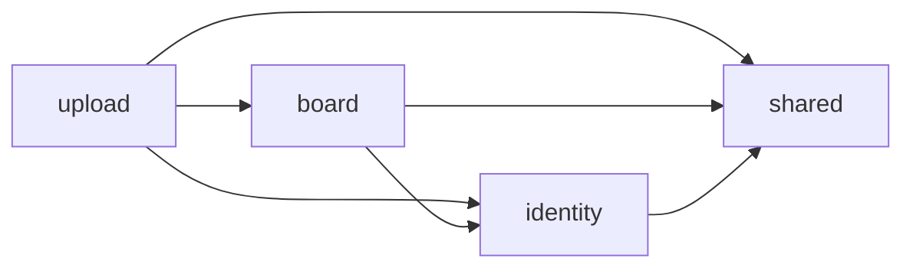

# Spring Modulith 기반 모듈형 모놀리스 전환 계획서

- 상태: 초안 — 구현 전
- 작성일: 2026-09-07
- 대상: `back/` Spring Boot 백엔드
- 기준: 로컬 소스의 패키지·의존성·업로드 완료 흐름과 저장소 운영 규칙
- 현재 기술: Spring Boot 3.5.11, Java 25, JPA, PostgreSQL, Flyway
- 목적: 하나의 애플리케이션을 유지하면서 업무 경계와 공개 계약을 명확히 하고, 경계 위반을 테스트로 검출한다.

이 문서는 전환 제안이다. Spring Modulith가 이미 적용되었거나 아래 검증을 통과했다는 의미는 아니다. 이번 작업은 계획서 작성이며 구현·운영 배포는 포함하지 않는다.

사용자의 계획서 승인 후 테스트 코드 작성과 리팩터링을 시작한다. 계획서 수정 요청을 구현 승인으로 해석하지 않는다.

## 1. 추진 배경과 기대 효과

현재 백엔드는 `auth`, `board`, `common` 패키지로 구분되어 있다. 그러나 계정 Repository를 게시판·업로드에서 직접 사용하고, 계정 관리가 게시판 예외에 의존한다. 업로드 완료 로직도 게시글·첨부 저장을 직접 수행한다.

Spring Modulith를 활용해 다음을 개선한다.

1. 계정·게시판·업로드의 책임과 의존 방향을 명확히 한다.
2. 다른 모듈의 Repository·JPA 엔티티를 직접 사용하는 경로를 공개 서비스 계약으로 바꾼다.
3. 순환 의존, 내부 패키지 접근, 허용되지 않은 모듈 참조를 빌드 과정에서 검출한다.
4. 기존 API 동작과 데이터 일관성을 유지하면서 모듈별 변경 영향을 줄인다.
5. 실제 코드에서 모듈 구조 문서를 생성해 설계와 구현의 차이를 줄인다.

목표는 구조와 유지보수성 개선이다. 처리 속도 향상이나 MSA 전환을 성과로 전제하지 않는다. 모듈형 모놀리스를 최종 운영 구조로 유지할 수 있다.

## 2. 범위

### 포함

- Spring Modulith 의존성과 구조 검증 테스트 도입
- 단일 Gradle 프로젝트 안에서 패키지 기반 모듈 구성
- 계정·게시판·업로드의 공개 API와 내부 구현 구분
- 모듈 간 직접 Repository·엔티티 의존 제거
- 전역 예외 처리와 공통 코드의 의존 방향 정리
- 기존 보안·업로드·첨부 기능의 회귀 검증
- 모듈 구조와 개발 규칙 문서화

### 이번 전환에서 제외

- MSA, 별도 서비스 프로세스, Gradle 멀티 프로젝트 전환
- Kafka·Temporal·Kubernetes 도입
- 모듈 간 호출의 일괄 비동기 이벤트 전환
- API 경로·요청/응답 계약·업로드 암호화 포맷 변경
- DB 분리·스키마 변경·기존 Flyway SQL 수정
- 프론트 기능 변경, AI 답변 생성 기능 재개
- 인증을 Spring Security filter chain으로 이전하는 작업

모듈 간 호출은 필요한 경우 같은 JVM의 Spring Bean을 동기 호출한다. 이벤트가 필요한 후속 기능은 별도 설계로 다룬다.

## 3. 현재 구조에서 확인한 개선 지점

| 위치 | 현재 상태 | 전환 방향 |
| --- | --- | --- |
| `board/service/BoardService.java` | `auth.AdminRepository`, `auth.Admin` 참조 | 계정 공개 API에서 필요한 사용자 정보·역할 조회 |
| `board/service/UploadSessionService.java` | 계정 Repository와 게시글·첨부 Repository 직접 사용 | 계정 조회 API와 게시판 생성 API 호출 |
| `auth/UserManagementService.java` | `board.exception.NotFoundException` 참조 | 계정 소유 예외로 변경하고 HTTP 계약 유지 |
| `common/web/GlobalExceptionHandler.java` | 인증·게시판의 구체 예외를 함께 참조 | 모듈별 예외 처리 또는 별도 웹 조립 영역으로 책임 정리 |
| `board/` | 게시판·첨부·업로드 세션의 코드가 함께 존재 | 업로드 세션 영역을 독립 모듈로 분리 |
| `auth/` | 엔티티·Repository·서비스가 같은 기본 패키지에 존재 | 공개 API와 내부 구현을 구분 |

현재 `board → auth`와 `auth → board` 참조가 모두 존재한다. 구체적인 전체 위반 목록은 도입 단계에서 구조 검증으로 확정한다. `common`도 이름만으로 공통 기반으로 취급하지 않고 실제 참조를 점검한다.

주의: Spring Modulith 기본 규칙에서는 모듈 기본 패키지의 public 타입이 공개 API로 취급될 수 있다. 현재 패키지를 그대로 두고 검증만 통과시키면 Repository 노출이 남을 수 있으므로 내부 구현 이동이 필요하다.

## 4. 목표 모듈 구성

```text
com.llm.app
├─ LlmApplication
├─ identity                 계정·인증 모듈
│  ├─ 공개 서비스·값 객체·공개 오류 계약
│  └─ internal              엔티티·Repository·JWT 구현·컨트롤러
├─ board                    게시판 모듈
│  ├─ 업로드 결과 게시글 생성 계약
│  └─ internal              게시글·댓글·첨부·파일 삭제 처리
├─ upload                   업로드 모듈
│  └─ internal              청크·세션·복원·wire codec·만료 정리
└─ shared                   최소 공통 타입·기술 유틸리티
```

`auth → identity` 명칭 변경은 계정 관리와 인증을 포괄하는 목표안이다. 대규모 이동에 앞서 기존 `auth` 경계부터 정리하고 마지막에 이름을 바꾸는 방식도 가능하다. 이름 변경 자체보다 의존성 정리가 우선이다.

컨트롤러·모듈 고유 예외 처리기는 해당 모듈 내부에 둔다. 모듈 내부 HTTP DTO는 다른 모듈에 무조건 공개하지 않는다. 내부 모듈 API는 Java 호출 계약이며 외부 HTTP 엔드포인트 추가를 뜻하지 않는다.

Health·CORS·일반 HTTP 오류 처리처럼 애플리케이션 전체에 적용되는 코드는 별도 기술 영역으로 정리한다. 최종 배치와 모듈 탐지 규칙은 첫 구조 검증 결과를 보고 결정한다. 광범위한 검증 제외로 경계 위반을 숨기지 않는다.

### 의존 방향



- `identity`는 `board`, `upload`를 참조하지 않는다.
- `board`는 `upload`를 참조하지 않는다.
- `shared`는 업무 모듈을 참조하지 않는다.
- 첨부 메타데이터와 실제 첨부파일의 생명주기는 우선 `board`가 소유한다.
- 업로드 임시 청크·복원 파일·세션 상태는 `upload`가 소유한다.
- DB는 하나를 유지하되 각 테이블에 접근하는 Repository의 모듈 소유권을 명확히 한다.

## 5. 공개 계약 설계 초안

다음 이름은 역할을 설명하기 위한 가칭이다. 기존 호출·오류·잠금 동작을 조사한 후 시그니처를 확정한다.

| 계약 | 책임 | 경계에서 제외할 것 |
| --- | --- | --- |
| `IdentityAccess` | 계정 존재 확인, 사용자 ID·표시명·역할 반환 | `Admin` 엔티티, `AdminRepository`, 비밀값 |
| 인증 공개 진입점 | 컨트롤러가 JWT와 계정 존재 여부를 검증 | 토큰 파싱 구현에 대한 외부 직접 접근 |
| `UploadedPostCreator` | 검증된 업로드 결과로 게시글·첨부를 함께 등록 | 게시글·첨부 Repository, 내부 Mapper |
| 업로드 결과 값 객체 | 생성된 게시글 ID 등 호출자가 필요한 결과 전달 | 지연 로딩되는 JPA 엔티티 |

외부 finalize 응답은 기존 게시글 상세 JSON 형태를 유지한다. 이를 위한 공개 결과 DTO 또는 조회 계약을 설계하고, 업로드 컨트롤러가 게시판 내부 HTTP DTO·Mapper를 직접 가져오지 않게 한다.

복원 파일 전달에는 원본 파일명, 검증된 크기, 사용자 ID, 파일 접근 수단 등이 필요하다. 서버 내부의 임시 `Path`를 전달할지 스트림 추상화를 사용할지는 파일 수명과 복사 비용을 확인한 뒤 결정한다. 클라이언트가 지정한 임의 경로를 받는 API는 만들지 않는다.

## 6. 반드시 보존할 동작

### 인증·권한

- 보호 컨트롤러는 공통 `JwtProvider.authenticate`를 통한 JWT·계정 존재 검증을 유지한다. 클래스 이동 시에도 공통 인증 진입점을 유지한다.
- JWT subject의 계정 ID와 `tokenVersion=2`, 고정 만료 동작을 유지한다.
- 게시글·댓글 수정/삭제는 작성자 본인 또는 ADMIN만 허용한다.
- 작성자 ID가 null인 레거시 데이터는 ADMIN만 관리한다.
- 일괄 삭제는 대상 전체의 권한을 확인하고, 실패 시 부분 삭제하지 않는다.
- 업로드 소유권과 계정 삭제 후 접근 차단을 유지한다.
- 기존 HTTP 상태 코드·오류 코드와 인증 오류 처리 계약을 유지한다.

### 업로드 완료·첨부 일관성

현재 `finalizeSession`은 게시글·첨부 저장과 세션 행 정리를 같은 트랜잭션에서 수행하고, 커밋 후 세션 디렉터리를 정리한다. 실패 상태 기록은 별도 서비스로 호출한다.

전환 후 흐름은 다음과 같다.

1. `upload`가 사용자·소유권·세션·청크를 검증한다.
2. `upload`가 ZIP을 복원하고 크기·해시를 검증한다.
3. `upload`가 `board`의 공개 생성 API를 동기 호출한다.
4. `board`가 게시글·첨부 메타데이터를 저장하고, 신규 파일의 롤백 정리를 등록한다.
5. `upload`가 세션 행을 정리하고, 커밋 후 임시 디렉터리 정리를 등록한다.
6. 기존 형식의 응답을 반환한다.

게시판 생성 API는 기존 트랜잭션에 참여하도록 설계한다. 모듈을 분리했다는 이유로 별도 커밋이나 비동기 실행을 추가하지 않는다. 게시글·첨부·세션 상태가 부분적으로 커밋되지 않는지 검증한다.

- 첨부 메타데이터 삭제와 `attachment_file_deletions` 등록을 같은 트랜잭션으로 유지한다.
- 실제 첨부파일 삭제는 커밋 이후 수행하며, 실패 시 기존 재시도 동작을 유지한다.
- 신규 첨부파일은 트랜잭션 롤백 시 정리한다.
- 실패 상태 기록의 트랜잭션 전파와 원래 예외 보존 동작을 확인한다.
- Base64 청크, alias 키, AES-GCM wire format, 재개·만료 동작을 유지한다.
- `FILE_CONVERSION_REQUEST` 생성 제한과 AI 답변 보호·410 종료 응답을 유지한다.

## 7. Phase별 실행·중단·재개 계획

각 Phase를 독립적으로 검토하고 중단할 수 있는 작업 단위로 관리한다. 실행 시간이나 사용량 한도로 중단되더라도 이 문서와 Git 상태만으로 다음 작업을 확인할 수 있게 한다. Phase 하나가 반드시 한 세션에 끝난다고 가정하지 않는다.

계획서 승인은 아직 대기 상태다. 아래 상태는 이미 수행한 환경 점검과 앞으로 수행할 구현을 구분한 것이며, Phase 구분 자체가 구현 승인은 아니다.

### 진행 현황

| Phase | 작업 | 상태 | 선행 조건 | 완료 기준 |
| --- | --- | --- | --- | --- |
| 0 | 환경·기준선 확보 | 진행 중 — 기본 환경 확인 완료 | 환경 점검 요청 | 기존 테스트·일회용 PostgreSQL 검증 환경·작업 범위 기록 |
| 1 | 회귀 테스트 선행 작성 | 미착수 | 계획서 승인, Phase 0 완료 | 기존 동작 보호 테스트 통과, 누락·기존 결함 기록 |
| 2 | Modulith 도입·구조 진단 | 미착수 | Phase 1 완료 | 호환 버전 확정, 모듈 모델·전체 위반 목록 확보 |
| 3 | 계정 모듈 경계 정리 | 미착수 | Phase 2 완료 | 계정 저장소 직접 참조 제거, 공개 계약·회귀 테스트 통과 |
| 4 | 공통 코드·웹 오류 처리 정리 | 미착수 | Phase 3 완료 | 공통 영역의 업무 의존 해소, HTTP 오류 계약 유지 |
| 5 | 게시판 공개 API 도입 | 미착수 | Phase 4 완료 | 생성 계약·finalize 원자성·파일 정리 테스트 통과 |
| 6 | 업로드 모듈 분리 | 미착수 | Phase 5 완료 | upload가 공개 계약만 사용, 해당 경계·업로드 테스트 통과 |
| 7 | 전체 경계 강제·문서화 | 미착수 | Phase 6 완료 | 엄격한 구조 검증 통과, 실제 모듈 문서 생성 |
| 8 | 최종 통합 검증 | 미착수 | Phase 7 완료 | 전체 테스트·PostgreSQL 검증·컨테이너·8083 health 결과 기록 |

상태는 `미착수 / 진행 중 / 중단 / 차단 / 완료`로 기록한다. 시간이 지났다는 이유로 완료 처리하지 않는다. 차단 상태에는 필요한 환경이나 결정 사항을 구체적으로 적는다.

### Phase 0 — 환경·기준선 확보

**작업**

- [x] 로컬 Docker·Compose 사용 권한, 네트워크, 현재 앱 health 확인
- [x] Java 25 설치 및 Gradle 실행 방법 확인
- [x] 기존 백엔드 테스트 실행
- [x] 현재 PostgreSQL 관리자 권한 확인
- [ ] 기존 앱 DB와 분리된 일회용 PostgreSQL 준비 및 전용 테스트 실행
- [ ] 구현 시작 시점의 Git 기준 커밋·기존 변경 파일 목록 기록

**2026-09-07 확인 결과**

- Docker·Compose 사용 가능, `auto_default` 존재, 현재 front/back healthy, 8083 health 정상.
- 로컬 DB 컨테이너 이름은 `postgres`이며 운영 문서의 EC2 컨테이너 이름과 다르다.
- 첨부·업로드 경로의 volume 연결과 컨테이너 사용자 쓰기 권한 정상.
- Maven Central 접근 정상. 추가 관리자 권한이나 DB 권한 부여는 필요하지 않음.
- 기본 Java는 21. 설치된 Java 25 경로를 Gradle에 명시하면 실행 가능.
- 기존 테스트 **134개 통과, PostgreSQL 전용 1개 건너뜀**. 신규 테스트나 리팩터링은 아직 수행하지 않음.
- 현재 `postgres` 역할은 이미 SUPERUSER·DB 생성·역할 생성·로그인 권한 보유. 권한 변경 없음.
- `LLM_TEST_POSTGRES_URL` 미설정. 기존 전용 테스트는 localhost의 일회용 `postgres` DB를 요구하므로 현재 앱 DB를 대상으로 실행하지 않음.

재현 명령(저장소 루트에서):

```powershell
cd back
.\gradlew.bat '-Porg.gradle.java.installations.paths=C:/jdk/jdk-25.0.2+10' clean test
```

**중단 지점:** 점검 결과와 남은 환경 준비를 기록한 상태. 일회용 DB를 만들면 컨테이너명·이미지·localhost 포트·테스트 스키마·유지/정리 여부도 기록한다. 비밀번호나 토큰은 기록하지 않는다.

### Phase 1 — 회귀 테스트 선행 작성

**작업:** 기존 테스트와 요구 동작을 대조하고, 인증·권한·업로드 실패·DB 롤백·파일 정리 중 누락된 시나리오를 먼저 작성한다. 상세 시나리오는 8절을 따른다.

**완료 기준:** 리팩터링 전 구현에서 보존할 동작의 테스트가 통과한다. 기존 결함은 원인과 처리 범위를 별도 기록한다.

**중단 지점:** 완성한 테스트와 실행 결과를 저장한다. 실패 중인 테스트가 있다면 실패 원인과 아직 검증하지 못한 시나리오를 적는다. 구조 변경은 시작하지 않는다.

### Phase 2 — Modulith 도입·구조 진단

**작업:** Boot 3.5.11·Java 25와 호환되는 안정 버전/BOM을 확인하고 최소 의존성을 추가한다. 구조 진단을 실행해 탐지된 모듈·순환·내부 접근 위반을 기록한다.

**완료 기준:** 선택 버전·모듈 탐지 범위·위반 목록을 확보하고 기존 동작 테스트가 통과한다. 진단으로 얻은 현재 위반 목록과 최종적으로 통과해야 하는 엄격한 구조 테스트를 구분한다.

**중단 지점:** 의존성 변경과 진단 결과가 재현 가능하다. 초기 구조 진단의 실패를 숨기거나 동작 테스트 실패를 정상 완료로 처리하지 않는다.

### Phase 3 — 계정 모듈 경계 정리

**작업:** 계정 공개 API 계약 테스트를 먼저 작성한다. API를 도입하고 엔티티·Repository를 내부화한다. 게시판·업로드의 계정 저장소 직접 참조와 계정 관리의 게시판 예외 참조를 제거한다.

**완료 기준:** 계정 공개 계약·인증·권한 회귀 테스트와 전체 백엔드 테스트가 통과한다. `auth → identity` 이름 변경 여부와 실제 완료 범위를 기록한다.

**중단 지점:** 공개 API 호출자로 전환한 클래스와 남은 호출자를 구분한다. 패키지 이동 도중이라면 컴파일 실패 위치를 기록하고 Phase는 완료로 표시하지 않는다.

### Phase 4 — 공통 코드·웹 오류 처리 정리

**작업:** 모듈 고유 예외 처리와 공통 HTTP 처리를 정리한다. shared가 업무 모듈을 참조하지 않도록 하고, 예외 매핑 테스트를 보강한다.

**완료 기준:** 기존 상태 코드·오류 코드·응답 형태와 전체 백엔드 테스트를 유지하면서 목표 의존 방향을 충족한다.

**중단 지점:** 이동한 예외·처리기와 아직 전역 처리기에 남은 항목을 기록한다.

### Phase 5 — 게시판 공개 API 도입

**작업:** 업로드 결과 게시글·첨부 생성 계약과 중간 실패 테스트를 먼저 작성한다. 생성 로직을 게시판 내부로 이동하고 upload가 동기 호출하게 한다.

**완료 기준:** 기존 트랜잭션 참여, 게시글·첨부·세션의 원자성, 파일 커밋·롤백 정리, 기존 finalize 응답을 확인하고 전체 백엔드 테스트가 통과한다.

**중단 지점:** 계약 DTO·파일 소유권·트랜잭션 경계를 기록한다. 이 Phase는 위험도가 높으므로 실패 주입 테스트를 마치기 전에 다음 모듈 이동을 시작하지 않는다.

### Phase 6 — 업로드 모듈 분리

**작업:** 목표 의존성 테스트 작성 후 세션·청크·임시 저장소·wire codec·스케줄러를 upload로 이동한다. 게시판 내부 DTO·Mapper 참조도 공개 계약으로 전환한다.

**완료 기준:** upload가 board의 공개 계약만 사용하며 업로드 회귀·해당 경계 검증과 전체 백엔드 테스트가 통과한다.

**중단 지점:** 이동 완료 클래스, 남은 참조, 스케줄러·Bean 등록 확인 여부를 기록한다.

### Phase 7 — 전체 경계 강제·문서화

**작업:** 허용 의존을 선언하고 엄격한 구조 검증을 일반 테스트 실행에 포함한다. 실제 코드에서 모듈 문서를 생성하고 개발 규칙을 갱신한다.

**완료 기준:** 순환 의존·내부 접근·허용 의존 검증과 전체 백엔드 테스트가 통과한다. 광범위한 검증 제외·모든 모듈 개방·테스트 비활성화로 통과시키지 않는다.

**중단 지점:** 남은 위반과 문서 생성 결과를 기록한다. Phase 2의 초기 위반이 모두 해결되었는지 대조한다.

### Phase 8 — 최종 통합 검증

**작업:** 전체 백엔드 테스트와 일회용 PostgreSQL 검증을 실행한다. 최신 로컬 소스로 이미지를 재빌드하고 컨테이너 기동·8083 health·정상 업로드와 다운로드를 확인한다.

**완료 기준:** 테스트 실행·실패·건너뜀, 검증 이미지와 소스 기준, 통합 결과 및 환경 제한을 기록하고 11절 체크리스트를 충족한다. 기존 PostgreSQL 테스트의 지원 범위가 모든 기능의 PostgreSQL 검증을 뜻하지는 않는다.

**중단 지점:** 빌드·컨테이너 작업의 실행 중 여부와 이미지 교체 여부를 기록한다. 로컬 통합 검증 완료와 EC2 배포 완료를 구분한다. EC2 배포는 이 Phase에 포함하지 않는다.

### 중단·재개 운영 규칙

1. 사용량·시간 한도가 가까워지면 새 대규모 이동을 시작하지 않고 현재 변경·검증 결과부터 저장한다. 한도 도달 시점을 정확히 예측할 수 있다고 가정하지 않는다.
2. 통과한 테스트와 코드가 일치하는 시점을 우선 중단 지점으로 삼는다. 불가피하게 실패 중 중단하면 실제 실패·미완료 상태를 그대로 기록한다.
3. 가능하면 작은 작업이 끝날 때마다 아래 재개 기록을 갱신해 갑작스러운 중단에 대비한다. 커밋할 경우 메시지는 한글로 작성하고, 사용자 기존 변경을 함께 커밋하지 않는다.
4. 재개할 때 이 문서·저장소 지침·`git status --short`·기준 커밋 이후 diff를 먼저 확인한다. 기록과 실제 상태가 다르면 실제 파일·테스트 결과를 기준으로 조정한다.
5. 실행 중 Gradle·Docker 작업이 남아 있는지 먼저 확인한다. 이전 세션의 프로세스나 테스트를 무조건 중복 실행하지 않는다.
6. 이미 완료된 Phase 전체를 반복하지 않는다. 이후 변경이나 환경 변화로 영향받은 검증만 다시 수행하고, 최종 전체 게이트는 유지한다.
7. 기존 승인 범위는 재개 후에도 유지한다. 일시 중단만을 이유로 같은 승인을 다시 요구하지 않는다. 현재는 구현 승인 대기 상태다.

### 재개 기록 — 작업 시 갱신

```text
기록 일시: 2026-09-07 (Phase 계획 정리 시점)
승인 범위: 계획서 작성·수정 및 로컬 환경 점검
구현 승인: 대기
현재 Phase: 0 (기본 환경 확인 완료, 일회용 PostgreSQL 미준비)
마지막 완료 Phase: 없음
기준 커밋/브랜치: 구현 시작 시 기록
기존 변경: plan/spring-modulith-migration-plan.md 및 docs/modern-web-architecture-guide.html 미추적 (재개 시 Git 상태 재확인)
이번 작업 파일: plan/spring-modulith-migration-plan.md
마지막 검증: Java 25 경로 지정 clean test — 134 통과, 1 건너뜀
실패/건너뜀: PostgreSQL 전용 테스트 환경변수·일회용 DB 미준비
실행 중 작업: 없음 (재개 시 실제 프로세스 확인)
환경 변경: 없음, DB 권한 부여 없음
다음 작업: 승인 범위 확인 후 Phase 0의 남은 항목부터 진행
미확정 사항: 일회용 DB 식별자·포트, Modulith 호환 버전, 공개 API 계약
```

이 기록에 secret·토큰·비밀번호·전체 환경변수 덤프를 넣지 않는다. 테스트 로그가 민감 정보를 포함할 수 있으므로 필요한 결과만 요약한다. 예상 소요 시간은 Phase 0~2에서 실제 위반 수와 테스트 비용을 확인한 뒤 조정하며, 전체 작업이 5시간 안에 끝난다고 보장하지 않는다.

## 8. 검증 계획

### 테스트 코드 작성 원칙

테스트 작성은 리팩터링 완료 후의 부가 작업이 아니라 각 단계의 선행 작업으로 수행한다. 기존 동작 보호와 새 계약 설계를 구분해 진행한다.

1. **기존 동작 고정:** 기존 테스트를 먼저 실행하고, 보존할 동작 중 누락된 사례를 회귀 테스트로 작성한다. 기존 구현에서 통과한 뒤 구조를 변경한다. 현재 결함을 발견하면 잘못된 동작을 정상 계약으로 고정하지 않고 원인과 처리 범위를 기록한다.
2. **새 계약에 TDD 적용:** 새 모듈 공개 API와 목표 의존성에 대한 테스트를 먼저 작성한다. 의도한 이유로 실패하는지 확인한 뒤 최소 구현으로 통과시키고 구조를 정리한다.
3. **작은 단위로 반복:** 테스트 작성 → 실패 원인 확인 → 구현·이동 → 관련 테스트 통과 → 리팩터링 순으로 진행한다. 초기 구조 진단의 알려진 위반은 목록으로 관리하고 해당 단계에서 제거한다.
4. **Phase별 게이트:** Phase 3~7의 각 구현 Phase 완료 시 인증·권한·업로드·롤백을 포함한 전체 백엔드 테스트를 통과시킨다. Phase 8에서는 모듈 구조 검증과 컨테이너 통합 검증까지 완료한다.
5. **동작 중심 검증:** 반환 값·HTTP 오류·DB 상태·파일 상태를 확인한다. 단순 메서드 호출 횟수나 현재 클래스 배치를 그대로 복제한 테스트에 의존하지 않는다.

### 작성할 테스트와 산출물

| 종류 | 작성·보강 내용 | 완료 증거 |
| --- | --- | --- |
| 기존 API 회귀 테스트 | 작성자·ADMIN 권한, 일괄 삭제 원자성, 삭제 계정 차단, 기존 응답·오류 계약 | 기존 테스트와 중복되지 않는 사례를 추가하고 변경 전후 결과 비교 |
| 모듈 구조 테스트 | 순환 의존·내부 패키지 접근·허용 의존 검증 | 일반 Gradle 테스트에 포함, 최종 목표 구조에서 통과 |
| 공개 API 계약 테스트 | 계정 존재·역할 조회, 업로드 결과 게시글·첨부 생성의 성공·실패 계약 | 실제 모듈 서비스와 필요한 DB를 사용하는 계약 검증 |
| 트랜잭션·파일 회귀 테스트 | finalize 중간 실패, DB 롤백, 신규 첨부 정리, 커밋 후 삭제와 재시도 | 실패 전후 DB·파일 상태를 함께 검증 |

중간 실패 테스트의 우선 시나리오는 다음과 같다. 기존 테스트가 충분히 다루는 사례는 재사용하고, 빠진 경우에만 작성한다.

- ZIP 복원 후 첨부 등록에 실패하면 게시글·첨부가 부분 커밋되지 않는지 확인한다.
- 신규 첨부파일 생성 후 트랜잭션이 실패하면 메타데이터와 파일이 남지 않는지 확인한다.
- 세션 행 정리 이후 커밋 전에 실패하면 세션·청크 행 삭제가 롤백되고 커밋 후 디렉터리 삭제가 실행되지 않는지 확인한다. 별도 실패 상태 기록은 기존 계약에 따라 검증한다.
- 첨부 삭제 트랜잭션이 롤백되면 기존 메타데이터·파일이 유지되는지 확인한다.
- DB 삭제 커밋 후 실제 파일 삭제에 실패하면 삭제 대기 기록이 남고 재시도로 정리되는지 확인한다.

실패 주입에는 필요한 경계의 테스트 대역을 사용할 수 있다. 트랜잭션·파일 일관성 테스트에서는 실제 트랜잭션 관리자, 테스트 DB와 격리된 파일 저장소를 사용한다. 테스트 자체의 자동 롤백으로 실제 커밋·커밋 후 콜백 검증이 생략되지 않게 한다.

테스트 산출물에는 테스트 코드, 시나리오별 보존 계약, 실행 결과를 포함한다. 커버리지 수치만으로 완료를 판단하지 않는다.

### 필수 검증

| 영역 | 검증 내용 |
| --- | --- |
| 구조 | `ApplicationModules.of(LlmApplication.class).verify()`로 순환·내부 접근·허용 의존 확인 |
| 공개 계약 | 외부로 공개된 타입에 Repository·JPA 엔티티가 섞이지 않았는지 확인 |
| 인증·계정 | 기존 로그인·JWT·계정 관리 테스트, 삭제된 계정 및 권한 회귀 |
| 게시판 | 생성·조회·수정·삭제·일괄 삭제, 레거시 작성자·AI 답변 보호 |
| 업로드 | 정상 finalize, 누락·잘못된 청크, 해시 오류, 소유권·만료·재개 |
| 트랜잭션·파일 | 생성 실패 시 DB 롤백·신규 파일 정리, 커밋 후 삭제, 삭제 재시도 |
| API 호환성 | 요청/응답 JSON·오류 코드·암호화 포맷·다운로드 동작 |
| 실행 | Spring Bean·JPA 스캔, 스케줄러 등록, 컨테이너 health |

기존 `BoardPostControllerTest`, `UploadSessionControllerTest`, 인증·계정 테스트와 `SecurityAndStorageRegressionTest`를 우선 활용한다. 모듈 경계와 트랜잭션 회귀를 검증하는 데 부족한 테스트만 보완한다. 폴더 이동 자체를 확인하는 테스트는 추가하지 않는다.

Windows 백엔드 게이트:

```powershell
cd back
.\gradlew.bat clean test
```

패키지 이동만으로 DDL을 변경할 필요는 없어야 한다. H2 테스트는 운영 PostgreSQL/Flyway 경로와 다르므로, 테스트 통과만으로 운영 스키마 검증까지 완료했다고 판단하지 않는다. 기존 PostgreSQL 검증 테스트의 실행 조건도 확인한다.

통합 확인은 최신 로컬 소스로 이미지를 다시 만든 뒤 수행한다. 이미지 태그는 저장소 규칙에 맞게 유지하고, `auto_default` 네트워크와 접근 가능한 PostgreSQL이 준비되어 있어야 한다.

```powershell
docker compose up -d --wait
curl.exe -fsS http://127.0.0.1:8083/api/v1/health
```

기대 health 응답은 `{"status":"UP"}`이다. 최종 확인에서 테스트 실행 건수·실패·건너뛴 항목과 환경 제한을 기록한다. 프론트 변경이 추가될 경우에는 프론트 typecheck·build 게이트도 수행한다.

## 9. 위험과 대응

| 위험 | 대응 |
| --- | --- |
| 패키지 이동 후 Bean·엔티티·Repository 누락 | 애플리케이션 루트 아래 구조 유지, 전체 컨텍스트와 컨테이너 기동 확인 |
| 계정 조회 API가 엔티티를 그대로 노출 | 사용자 ID·표시명·역할 등 필요한 값만 반환 |
| 예외 이동으로 HTTP 상태·오류 코드 변경 | 기존 API 테스트 유지, 모듈별 예외 매핑 검증 |
| 서비스 분리 후 트랜잭션 전파 변경 | Spring Bean 간 호출과 기존 트랜잭션 참여 확인, 중간 실패 검증 |
| 파일 정리 담당이 중복되거나 누락 | 임시 파일은 upload, 영구 첨부는 board로 소유권 명시 |
| shared가 업무 코드 집합으로 확대 | 업무 모듈 참조 금지, 공통화 근거가 있는 코드만 이동 |
| 지나친 모듈 분할로 계약만 증가 | 첨부는 board 내부에 유지, 별도 분리는 실제 요구가 생길 때 검토 |
| 호환되지 않는 Modulith 버전 선택 | 구현 시작 시 공식 호환 정보 확인, BOM·의존성 해석·테스트 검증 |

## 10. 배포·복구 원칙

계획서 작성에는 운영 배포를 포함하지 않는다. 실제 배포 단계에서는 기존 Windows 이미지 빌드 → tar 전송 → EC2 docker load → compose 기동 절차를 따른다.

- 하나의 백엔드 이미지와 하나의 DB·스키마를 유지한다.
- DB 마이그레이션 변경이 필요해지면 구조 전환과 분리하여 다시 검토한다.
- 배포 전 기존 정상 이미지의 ID 또는 복구용 아카이브를 확보한다.
- 동일 태그 재사용 시 이전 이미지가 덮일 수 있으므로 복구할 이미지 식별자를 기록한다.
- 문제가 생기면 기존 정상 이미지를 복원하고 8083 health와 주요 API를 확인한다.
- 이미지 롤백은 실행 중 생성·변경된 DB 데이터나 첨부파일을 되돌리는 작업이 아니다.
- 운영 volume 삭제·prune 또는 DB history 수정으로 기동 문제를 우회하지 않는다.

## 11. 최종 완료 기준

- [ ] 리팩터링 전에 누락된 회귀 테스트를 작성하고 기존 동작의 기준선을 확보했다.
- [ ] 새 모듈 공개 API·의존성 계약을 테스트로 정의하고 구현 후 통과시켰다.
- [ ] 단계별 인증·권한·업로드·롤백 테스트 실행 결과가 기록되었다.
- [ ] identity·board·upload의 책임과 의존 방향이 코드로 명확하다.
- [ ] 모듈 외부에서 내부 Repository·엔티티·Mapper에 직접 접근하지 않는다.
- [ ] Spring Modulith 구조 검증이 일반 테스트 실행에 포함되어 통과한다.
- [ ] 기존 인증·권한·API·업로드 wire 계약이 유지된다.
- [ ] finalize의 DB 원자성과 첨부 커밋·롤백 후 정리 동작이 검증되었다.
- [ ] 전체 백엔드 테스트 및 로컬 컨테이너 통합 검증 결과가 기록되었다.
- [ ] API·환경 변수·DB 스키마 변경 없이 목표를 달성했거나, 추가 변경이 별도 문서화되었다.
- [ ] 실제 모듈 구조 문서와 관련 개발 안내가 갱신되었다.

## 12. 구현 전 확정할 사항

1. 호환되는 Spring Modulith 안정 버전과 최소 의존성 조합
2. `identity` 명칭 변경 시점과 기술 설정·전역 HTTP 처리의 최종 위치
3. 계정 공개 API의 반환 값과 오류 계약
4. 업로드 결과 파일의 전달 방식·소유권·수명
5. 게시판 생성 결과를 기존 finalize 응답으로 변환하는 계약
6. 현재 회귀 테스트가 다루지 못하는 중간 실패 지점과 PostgreSQL 검증 환경

위 항목은 구현 단계의 조사·설계 결정 사항이다. 모두 별도의 사용자 승인 절차를 뜻하지 않는다.

## 13. 참고 자료

- [Spring Modulith 기본 개념·패키지 기반 모듈](https://docs.spring.io/spring-modulith/reference/fundamentals.html)
- [Spring Modulith 구조 검증 규칙](https://docs.spring.io/spring-modulith/reference/verification.html)
- [Spring Modulith 이벤트 처리](https://docs.spring.io/spring-modulith/reference/events.html)
- [현재 아키텍처](../docs/04-architecture.md)
- [API 레퍼런스](../docs/07-api-reference.md)
- [테스트·품질 게이트](../docs/10-testing-quality.md)
- [보안 규칙](../docs/14-security.md)
- [계정 ID·첨부 일관성 검증](../docs/18-integrity-hardening.md)

공식 문서 기본 URL은 최신 버전을 가리킬 수 있다. 실제 구현에서는 선택한 버전의 문서와 호환 정보를 기준으로 적용한다.
